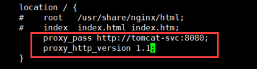
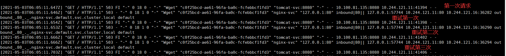

# istio部署

## 一、灰度发布

灰度发布也叫金丝雀部署 ，是指通过控制流量的比例，实现新老版本的逐步更替。\
比如对于服务A 有 version1、 version2 两个版本 ， 当前两个版本同时部署， 访问version1比例90% ，访问version2比例10% ，看运行效果，如果效果好逐步调整流量占比 80～20 ，70～30 ·····10～90 ，0，100 ，最终version1版本下线。\


灰度发布的特点：\
1）新老板共存\
2）可以实时根据反馈动态调整占比\
3）理论上不存在服务完全宕机的情况。\
4）适合于服务的平滑升级与动态更新。

## 二、灰度发布步骤

### **1、使用deployment创建两个版本的服务**

```html
vim deployment-v1.yaml

apiVersion: apps/v1
kind: Deployment
metadata:
  name: appv1
  labels:
    app: v1
spec:
  replicas: 1
  selector:
    matchLabels:
      app: v1
      apply: canary
  template:
    metadata:
      labels:
        app: v1
        apply: canary
    spec:
      containers:
      - name: nginx
        image: xianchao/canary:v1
        ports:
        - containerPort: 80
        
vim deployment-v2.yaml

apiVersion: apps/v1
kind: Deployment
metadata:
  name: appv2
  labels:
    app: v2
spec:
  replicas: 1
  selector:
    matchLabels:
      app: v2
      apply: canary
  template:
    metadata:
      labels:
        app: v2
        apply: canary
    spec:
      containers:
      - name: nginx
        image: xianchao/canary:v2
        ports:
        - containerPort: 80
```

### **2、创建service服务**

```
vim service.yaml

apiVersion: v1
kind: Service
metadata:
  name: canary
  labels:
    apply: canary
spec:
  selector:
    apply: canary
  ports:
    - protocol: TCP
      port: 80
      targetPort: 80
```

### **3、创建gateway服务**

```
vim gateway.yaml

apiVersion: networking.istio.io/v1beta1
kind: Gateway
metadata:
  name: canary-gateway
spec:
  selector:
    istio: ingressgateway
  servers:
  - port:
      number: 80
      name: http
      protocol: HTTP
    hosts:
    - "*"
```

### **4、创建virtualservice服务**

```
vim virtualservice.yaml

apiVersion: networking.istio.io/v1beta1
kind: VirtualService
metadata:
  name: canary
spec:
  hosts:
  - "*"
  gateways:
  - canary-gateway
  http:
  - route:
    - destination:
        host: canary.istio-test.svc.cluster.local
        subset: v1
      weight: 90
    - destination:
        host: canary.istio-test.svc.cluster.local
        subset: v2
      weight: 10
```

### **5、创建DestinationRule服务**

```
vim DestinationRule.yaml

apiVersion: networking.istio.io/v1beta1
kind: DestinationRule
metadata:
  name: canary
spec:
  host: canary.istio-test.svc.cluster.local
  subsets:
  - name: v1
    labels:
      app: v1
  - name: v2
    labels:
      app: v2
```

## 三、获取Ingress\_port:验证金丝雀发布效果：

```
for i in `seq 1 100`; do curl 192.168.100.10:30508;done > 1.txt
```

打开1.txt可以看到结果有90次出现v1，10次出现canary-v2,符合我们预先设计的流量走向。

<pre><code>kubectl get svc -A
istio-system istio-ingressgateway LoadBalancer 10.101.195.226 15021:31230/TCP,80:<a data-footnote-ref href="#user-content-fn-1">30508</a>/T
CP,443:32458/TCP,31400:31578/TCP,15443:31081/TCP 7h42m
</code></pre>

## 四、熔断

熔断的目的是在出现故障或异常情况时，对服务进行自动的限流和隔离，以保护整个系统的稳定性和可用性。

#### **1、在k8s集群创建后端服务**

```
apiVersion: v1                                                                                                               
kind: ServiceAccount                                                                                                         
metadata:                                                                                                                    
  name: httpbin                                                                                                              
---                                                                                                                          
apiVersion: v1                                                                                                               
kind: Service                                                                                                                
metadata:                                                                                                                    
  name: httpbin                                                                                                              
  labels:                                                                                                                    
    app: httpbin                                                                                                             
    service: httpbin                                                                                                         
spec:                                                                                                                        
  ports:                                                                                                                     
  - name: http                                                                                                               
    port: 8000                                                                                                               
    targetPort: 80                                                                                                           
  selector:                                                                                                                  
    app: httpbin                                                                                                             
---                                                                                                                          
apiVersion: apps/v1                                                                                                          
kind: Deployment                                                                                                             
metadata:                                                                                                                    
  name: httpbin                                                                                                              
spec:                                                                                                                        
  replicas: 1                                                                                                                
  selector:                                                                                                                  
    matchLabels:                                                                                                             
      app: httpbin                                                                                                           
      version: v1                                                                                                            
  template:                                                                                                                  
    metadata:                                                                                                                
      labels:                                                                                                                
        app: httpbin                                                                                                         
        version: v1                                                                                                          
    spec:                                                                                                                    
      serviceAccountName: httpbin                                                                                            
      containers:                                                                                                            
      - image: docker.io/kennethreitz/httpbin                                                                                
        imagePullPolicy: IfNotPresent                                                                                        
        name: httpbin                                                                                                        
        ports:                                                                                                               
        - containerPort: 80  
```

### **2、配置熔断**

创建一个[目标规则](https://istio.io/docs/reference/config/networking/v1alpha3/destination-rule/%22%20/t%20%22\_blank)，在调用httpbin服务时应用断路器设置

```
apiVersion: networking.istio.io/v1beta1                                                                                      
kind: DestinationRule                                                                                                        
metadata:                                                                                                                    
  name: httpbin                                                                                                              
spec:                                                                                                                        
  host: httpbin                                                                                                              
  trafficPolicy:                                                                                                             
    connectionPool:                                                                                                          
      tcp:                                                                                                                   
        maxConnections: 1                                                                                                    
      http:                                                                                                                  
        http1MaxPendingRequests: 1                                                                                           
        maxRequestsPerConnection: 1                                                                                          
    outlierDetection:                                                                                                        
      baseEjectionTime: 3m                                                                                                   
      consecutiveGatewayErrors: 1                                                                                            
      interval: 1s                                                                                                           
      maxEjectionPercent: 100 
```

### **3、添加客户端访问httpbin服务**

创建一个客户端以将流量发送给httpbin服务

Fortio可以控制连接数，并发数和HTTP调用延迟。使用此客户端来“跳闸”在DestinationRule中设置的断路器策略。

```
apiVersion: v1                                                                                                               
kind: Service                                                                                                                
metadata:                                                                                                                    
  name: fortio                                                                                                               
  labels:                                                                                                                    
    app: fortio                                                                                                              
    service: fortio                                                                                                          
spec:                                                                                                                        
  ports:                                                                                                                     
  - port: 8080                                                                                                               
    name: http                                                                                                               
  selector:                                                                                                                  
    app: fortio                                                                                                              
---                                                                                                                          
apiVersion: apps/v1                                                                                                          
kind: Deployment                                                                                                             
metadata:                                                                                                                    
  name: fortio-deploy                                                                                                        
spec:                                                                                                                        
  replicas: 1                                                                                                                
  selector:                                                                                                                  
    matchLabels:                                                                                                             
      app: fortio                                                                                                            
  template:                                                                                                                  
    metadata:                                                                                                                
      annotations:                                                                                                           
        # This annotation causes Envoy to serve cluster.outbound statistics via 15000/stats                                  
        # in addition to the stats normally served by Istio. The Circuit Breaking example task                               
        # gives an example of inspecting Envoy stats via proxy config.                                                       
        proxy.istio.io/config: |-                                                                                            
          proxyStatsMatcher:                                                                                                 
            inclusionPrefixes:                                                                                               
            - "cluster.outbound"                                                                                             
            - "cluster_manager"                                                                                              
            - "listener_manager"                                                                                             
            - "server"                                                                                                       
            - "cluster.xds-grpc"                                                                                             
      labels:                                                                                                                
        app: fortio                                                                                                          
    spec:                                                                                                                    
      containers:                                                                                                            
      - name: fortio                                                                                                         
        image: fortio/fortio:latest_release                                                                                  
        imagePullPolicy: IfNotPresent                                                                                        
        ports:                                                                                                               
        - containerPort: 8080                                                                                                
          name: http-fortio                                                                                                  
        - containerPort: 8079                                                                                                
          name: grpc-ping   
```

### **4、触发断路器**

```
kubectl exec -it fortio-deploy-576dbdfbc4-z28m7 -c fortio -- /usr/bin/fortio load -c 2 -qps 0 -n 20 -loglevel Warning 
http://httpbin:8000/get
```

`-c 2: 指定并发连接数为 2。这表示在测试期间，将会模拟 2 个并发请求。`

`-qps 0: 指定每秒请求数为 0。这表示在测试期间，将以最大速率发送请求，即不限制每秒请求数。`

`-n 20: 指定总请求数为 20。这表示在测试期间，将发送总共 20 个请求`

### **5、拓展**

假设k8s集群有100个节点，每个节点是100vCPU、100g内存，基于deployment部署了3个pod，运行的服务是web服务，三个pod跑在不同的节点上，每个pod最多占用6g内存6vcpu，每个pod最多的请求数是100万，三个pod前端有个四层代理，通过istio熔断机制作用在三个pod前端的四层代理上，那熔断参数值如何设置？

`5.1 maxconnections: 设置TCP的最大连接数（小于节点的cpu核心数）`

`5.2 http1MaxPendingRequests: 挂起请求数（避免积压请求，导致雪崩）`

`5.3 maxRequestsPerConnection: 每个连接处理的请求个数（可以延长请求个数，请求完成后在关闭）`

`5.4 outlierdetection: 异常检测参数（检测异常流量,触发熔断机制）`

`5.4.1 consecutivegatewayerrors: 连续网关错误数（出现多次网关错误时，熔断触发）`

`5.4.2 interval: 检测的时间间隔（在当前时间段内进行异常检测）`

## 五、超时

下面例子模拟客户端调用 nginx，nginx 将请求转发给 tomcat。nginx 服务设置了超时时间为2秒，如果超出这个时间就不在等待，返回超时错误。tomcat服务设置了响应时间延迟10秒，任何请求都需要等待10秒后才能返回。client 通过访问 nginx 服务去反向代理 tomcat服务，由于 tomcat服务需要10秒后才能返回，但nginx 服务只等待2秒，所以客户端会提示超时错误。

### 1**、**部署nginx、tomcat服务

```
apiVersion: apps/v1                                                                                                                       
kind: Deployment                                                                                                                          
metadata:                                                                                                                                 
  name: nginx                                                                                                                             
spec:                                                                                                                                     
  selector:                                                                                                                               
    matchLabels:                                                                                                                          
      server: nginx                                                                                                                       
      app: web                                                                                                                            
  replicas: 1                                                                                                                             
  template:                                                                                                                               
    metadata:                                                                                                                             
      name: nginx                                                                                                                         
      labels:                                                                                                                             
        server: nginx                                                                                                                     
        app: web                                                                                                                          
    spec:                                                                                                                                 
      containers:                                                                                                                         
      - name: nginx                                                                                                                       
        image: nginx:1.14-alpine                                                                                                          
        imagePullPolicy: IfNotPresent 
---   
apiVersion: apps/v1                                                                                                                       
kind: Deployment                                                                                                                          
metadata:                                                                                                                                 
  name: tomcat                                                                                                                            
spec:                                                                                                                                     
  replicas: 1                                                                                                                             
  selector:                                                                                                                               
    matchLabels:                                                                                                                          
      server: tomcat                                                                                                                      
      app: web                                                                                                                            
  template:                                                                                                                               
    metadata:                                                                                                                             
      name: tomcat                                                                                                                        
      labels:                                                                                                                             
        server: tomcat                                                                                                                    
        app: web                                                                                                                          
    spec:                                                                                                                                 
      containers:                                                                                                                         
      - name: tomcat                                                                                                                      
        image: docker.io/kubeguide/tomcat-app:v1                                                                                          
        imagePullPolicy: IfNotPresent  
```

### 2**、**部署service服务

```
apiVersion: v1                                                                                                                            
kind: Service                                                                                                                             
metadata:                                                                                                                                 
  name: nginx-svc                                                                                                                         
spec:                                                                                                                                     
  ports:                                                                                                                                  
  - name: http                                                                                                                            
    protocol: TCP                                                                                                                         
    port: 80                                                                                                                              
    targetPort: 80                                                                                                                        
  selector:                                                                                                                               
    server: nginx                                                                                                                         
---                                                                                                                                       
apiVersion: v1                                                                                                                            
kind: Service                                                                                                                             
metadata:                                                                                                                                 
  name: tomcat-svc                                                                                                                        
spec:                                                                                                                                     
  ports:                                                                                                                                  
  - name: http                                                                                                                            
    protocol: TCP                                                                                                                         
    port: 8080                                                                                                                            
    targetPort: 8080                                                                                                                      
  selector:                                                                                                                               
    server: tomcat  
```

### 3**、**部署**virtualservice服务**

```
apiVersion: networking.istio.io/v1beta1                                                                                                   
kind: VirtualService                                                                                                                      
metadata:                                                                                                                                 
  name: nginx-vs                                                                                                                          
spec:                                                                                                                                     
  hosts:                                                                                                                                  
  - nginx-svc                                                                                                                             
  http:                                                                                                                                   
  - route:                                                                                                                                
    - destination:                                                                                                                        
        host: nginx-svc                                                                                                                   
    timeout: 2s                                                                                                                           
---                                                                                                                                       
apiVersion: networking.istio.io/v1beta1                                                                                                   
kind: VirtualService                                                                                                                      
metadata:                                                                                                                                 
  name: tomcat-vs                                                                                                                         
spec:                                                                                                                                     
  hosts:                                                                                                                                  
  - tomcat-svc                                                                                                                            
  http:                                                                                                                                   
  - fault:                                                                                                                                
      delay:                                                                                                                              
        percentage:                                                                                                                       
          value: 100                                                                                                                      
        fixedDelay: 10s                                                                                                                   
    route:                                                                                                                                
    - destination:                                                                                                                        
        host: tomcat-svc   
```

### **4、**VirtualService讲解

第一：故障注入：

```
http:
- fault:
    delay:
      percentage:
      value: 100
   fixedDelay: 10s
```

该设置说明每次调用 tomcat-svc 的 k8s service，都会延迟10s才会调用。

第二：调用超时：

```
hosts:
- nginx-svc
  http:
  - route:
    - destination:
      host: nginx-svc
    timeout: 2s
```

该设置说明调用 nginx-svc 的 k8s service，请求超时时间是 2s。

### 5、设置超时时间

<pre><code>kubectl exec -it nginx-tomcat-7dd6f74846-48g9f --  sh
<strong>    vi /etc/nginx/conf.d/default.conf
</strong></code></pre>

添加以下内容：



编辑完后，再执行如下语句验证配置和让配置生效：

`nginx -t`

`nginx -s reload`

### 6、验证超时

```
kubectl run busybox --image busybox:1.28 --restart=Never --rm -it busybox -- sh
       time wget -q -O - http://nginx-svc
```

## 六、**故障注入和重试** <a href="#hlk141792093" id="hlk141792093"></a>

### 1、删除上一步创建的svc

```
kubectl delete -f virtual-tomcat.yaml
```

### **2、**创建新的svc服务

```
apiVersion: networking.istio.io/v1beta1                                                                                                   
kind: VirtualService                                                                                                                      
metadata:                                                                                                                                 
  name: nginx-svc                                                                                                                         
spec:                                                                                                                                     
  hosts:                                                                                                                                  
  - nginx-vs                                                                                                                              
  http:                                                                                                                                   
  - route:                                                                                                                                
    - destination:                                                                                                                        
        host: nginx-svc                                                                                                                   
    retries:                                                                                                                              
      attempts: 3                                                                                                                         
      perTryTimeout: 2s                                                                                                                   
---                                                                                                                                       
apiVersion: networking.istio.io/v1beta1                                                                                                   
kind: VirtualService                                                                                                                      
metadata:                                                                                                                                 
  name: tomcat-svc                                                                                                                        
spec:                                                                                                                                     
  hosts:                                                                                                                                  
  - tomcat-vs                                                                                                                             
  http:                                                                                                                                   
  - route:                                                                                                                                
    - destination:                                                                                                                        
        host: tomcat-svc                                                                                                                  
    fault:                                                                                                                                
      abort:                                                                                                                              
        percentage:                                                                                                                       
          value: 100                                                                                                                      
        httpStatus: 503 
```

### 3、VirtualService讲解

第一：故障注入。该虚拟服务的作用对象就是 tomcat-svc。使用此故障注入后，在网格中该 tomcat 就是不可用的。

```
abort:
        percentage:
          value: 100
        httpStatus: 503
```

abort是模拟tomcat服务始终不可用，该设置说明每次调用 tomcat-svc 的 k8s service，100%都会返回错误状态码503。

第二：调用超时：

```
hosts:
- nginx-svc
  http:
  - route:
    - destination:
      host: nginx-svc
    reties:
      attempts: 3 
      perTryTimeout: 2s
```

该设置说明调用 nginx-svc 的 k8s service，在初始调用失败后最多重试 3 次来连接到服务子集，每个重试都有 2 秒的超时。

### 4、验证重试是否生效

<pre><code>kubectl run busybox --image busybox:1.28 --restart=Never --rm -it busybox -- sh
<strong>wget -q -O - http://nginx-svc
</strong>kubectl logs -f nginx-tomcat-7dd6f74846-rdqqf -c istio-proxy
</code></pre>

结果如下：



[^1]: 
