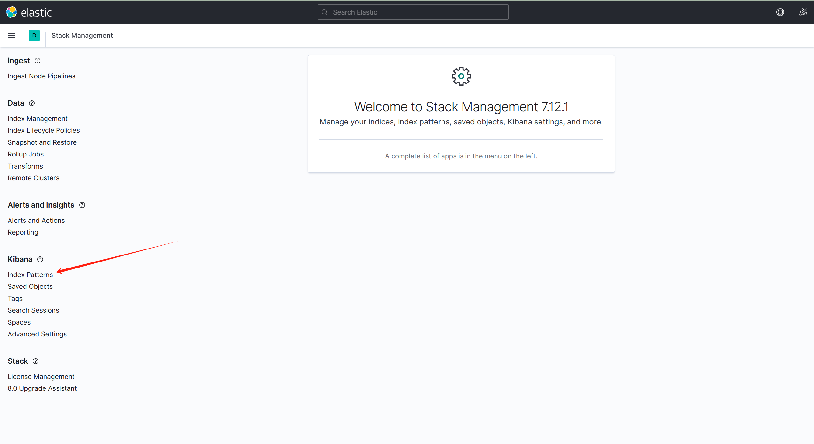

---
layout:
  title:
    visible: true
  description:
    visible: false
  tableOfContents:
    visible: true
  outline:
    visible: true
  pagination:
    visible: false
---

# 2024 BRICS Games

## B模块：容器云平台部署与运维（30分）

企业构建Kubernetes容器云集群，引入KubeVirt实现OpenStack到Kubernetes的全面转型，用Kubernetes来管一切虚拟化运行时，包含裸金属、VM、容器。同时研发团队决定搭建基于Kubernetes 的CI/CD环境，基于这个平台来实现DevOps流程。引入服务网格Istio，实现业务系统的灰度发布，治理和优化公司各种微服务，并开发自动化运维程序。

表2  IP地址规划

| 设备名称  | 主机名    | 接口   | IP地址                                             | 说明              |
| ----- | ------ | ---- | ------------------------------------------------ | --------------- |
| 云服务器1 | master | eth0 | <p>公网IP:********</p><p>私网IP:192.168.100.*/24</p> | Harbor也是使用该云服务器 |
| 云服务器2 | node   | eth0 | <p>公网IP:********</p><p>私网IP:192.168.100.*/24</p> |                 |

说明：

1.表1中的公网IP和私网IP以自己云主机显示为准，每个人的公网IP和私网IP不同。使用第三方软件远程连接云主机，使用公网IP连接。

2.华为云中云主机名字已命好，直接使用对应名字的云主机即可。

3.竞赛用到的软件包都在云主机/root下。

### 任务1 容器云服务搭建（6分）

### 一、部署容器云平台（6分）

在master节点和node节点将root密码设为000000，完成Kubernetes集群的部署，并完成Istio服务网格、KubeVirt虚拟化和Harbor镜像仓库的部署（master节点依次执行k8s\_harbor\_install.sh、k8s\_image\_push.sh、k8s\_master\_install.sh、k8s\_project \_install.sh，node节点执行k8s\_node\_install.sh）。

请将kubectl cluster-info&\&kubectl -n istio-system get all&\&kubectl -n kubevirt get deployment命令的返回结果提交到答题框。

操作步骤：

master节点


```
[root@master ~]# hostnamectl set-hostname master
[root@master ~]# vi /etc/hosts
127.0.0.1   localhost localhost.localdomain localhost4 localhost4.localdomain4
::1         localhost localhost.localdomain localhost6 localhost6.localdomain6
192.168.200.10 master
192.168.200.20 node
[root@master ~]# mkdir /opt/centos
[root@master ~]# mount CentOS-7-x86_64-DVD-2009.iso /opt/centos/
[root@master ~]# mount kubernetes_v1.6.iso /mnt/
[root@master ~]# cp -rvf /mnt/* /opt/
 
[root@master ~]# rm -rf /etc/yum.repos.d/*
 
[root@master ~]# vi /etc/yum.repos.d/local.repo
[local]
name=local
gpgcheck=0
enabled=1
baseurl=file:///opt/centos
[k8s]
name=k8s
gpgcheck=0
enabled=1
baseurl=file:///opt/kubernetes-repo
 
[root@master ~]# cd /opt/
[root@master opt]# ./k8s_harbor_install.sh
 
[root@master opt]# ./k8s_image_push.sh
输入镜像仓库地址(不加http/https): 192.168.200.10   
输入镜像仓库用户名: admin
输入镜像仓库用户密码: Harbor12345
您设置的仓库地址为: 192.168.200.10,用户名: admin,密码: xxx
是否确认(Y/N): Y
 
[root@master opt]# ./k8s_master_install.sh
[root@master ~]# scp /opt/k8s_node_install.sh node:/root/
 
[root@master ~]# yum install -y vsftpd  
[root@master ~]# echo "anon_root=/opt" >> /etc/vsftpd/vsftpd.conf
[root@master ~]# systemctl restart vsftpd
```


Node节点


```
[root@node ~]# hostnamectl set-hostname node
 
[root@node ~]## rm -rf /etc/yum.repos.d/*
[root@node ~]# vi /etc/hosts
127.0.0.1   localhost localhost.localdomain localhost4 localhost4.localdomain4
::1         localhost localhost.localdomain localhost6 localhost6.localdomain6
192.168.200.10 master
192.168.200.20 node
[root@node ~]# vi /etc/yum.repos.d/local.repo
[centos]
name=centos
gpgcheck=0
enabled=1
baseurl=ftp://192.168.200.10/centos
[k8s]
name=k8s
gpgcheck=0
enabled=1
baseurl=ftp://192.168.200.10/kubernetes-repo
[root@node ~]# ./k8s_node_install.sh
# 安装部署istio和kubevirt
[root@master opt]# ./k8s_project _install.sh
```


&#x20;答案

```
[root@master ~]# kubectl cluster-info&&kubectl -n istio-system get all&&kubectl -n kubevirt get deployment
Kubernetes control plane is running at https://192.168.100.105:6443
CoreDNS is running at https://192.168.100.105:6443/api/v1/namespaces/kube-system/services/kube-dns:dns/proxy
 
To further debug and diagnose cluster problems, use 'kubectl cluster-info dump'.
Warning: kubevirt.io/v1 VirtualMachineInstancePresets is now deprecated and will be removed in v2.
NAME                                       READY   STATUS    RESTARTS   AGE
pod/grafana-56bdf8bf85-cjtnw               1/1     Running   0          2m46s
pod/istio-egressgateway-85649899f8-svrkj   1/1     Running   0          2m52s
pod/istio-ingressgateway-f56888458-gpk6h   1/1     Running   0          2m52s
pod/istiod-64848b6c78-ng8vf                1/1     Running   0          2m56s
pod/jaeger-76cd7c7566-hflpz                1/1     Running   0          2m46s
pod/kiali-646db7568f-5k8vs                 1/1     Running   0          2m46s
pod/prometheus-85949fddb-z7c7v             2/2     Running   0          2m46s
 
NAME                           TYPE           CLUSTER-IP       EXTERNAL-IP   PORT(S)                                                                      AGE
service/grafana                ClusterIP      10.108.78.249    <none>        3000/TCP                                                                     2m46s
service/istio-egressgateway    ClusterIP      10.98.41.83      <none>        80/TCP,443/TCP                                                               2m52s
service/istio-ingressgateway   LoadBalancer   10.96.228.3      <pending>     15021:31902/TCP,80:30125/TCP,443:32162/TCP,31400:31827/TCP,15443:31436/TCP   2m52s
service/istiod                 ClusterIP      10.100.163.50    <none>        15010/TCP,15012/TCP,443/TCP,15014/TCP                                        2m56s
service/jaeger-collector       ClusterIP      10.107.163.161   <none>        14268/TCP,14250/TCP,9411/TCP                                                 2m46s
service/kiali                  ClusterIP      10.106.85.34     <none>        20001/TCP,9090/TCP                                                           2m46s
service/prometheus             ClusterIP      10.108.246.214   <none>        9090/TCP                                                                     2m46s
service/tracing                ClusterIP      10.98.9.225      <none>        80/TCP,16685/TCP                                                             2m46s
service/zipkin                 ClusterIP      10.110.212.28    <none>        9411/TCP                                                                     2m46s
 
NAME                                   READY   UP-TO-DATE   AVAILABLE   AGE
deployment.apps/grafana                1/1     1            1           2m46s
deployment.apps/istio-egressgateway    1/1     1            1           2m52s
deployment.apps/istio-ingressgateway   1/1     1            1           2m52s
deployment.apps/istiod                 1/1     1            1           2m56s
deployment.apps/jaeger                 1/1     1            1           2m46s
deployment.apps/kiali                  1/1     1            1           2m46s
deployment.apps/prometheus             1/1     1            1           2m46s
 
NAME                                             DESIRED   CURRENT   READY   AGE
replicaset.apps/grafana-56bdf8bf85               1         1         1       2m46s
replicaset.apps/istio-egressgateway-85649899f8   1         1         1       2m52s
replicaset.apps/istio-ingressgateway-f56888458   1         1         1       2m52s
replicaset.apps/istiod-64848b6c78                1         1         1       2m56s
replicaset.apps/jaeger-76cd7c7566                1         1         1       2m46s
replicaset.apps/kiali-646db7568f                 1         1         1       2m46s
replicaset.apps/prometheus-85949fddb             1         1         1       2m46s
NAME              READY   UP-TO-DATE   AVAILABLE   AGE
virt-api          2/2     2            2           94s
virt-controller   2/2     2            2           69s
virt-operator     2/2     2            2           2m
```

### 任务 2 容器云服务运维（15.5 分）

### 一、容器化部署 MariaDB（0.5 分）

编写 Dockerfile 文件 Dockerfile-mariadb 构建 pig-mariadb:v1.0 镜像， 要求基于 centos 完成 mariadb 服务的安装与配置，并设置服务开机自启。（需 要的包在 Technology\_packageV1.0.iso 中 Pig.tar.gz，解压到 root 目录下操 作）

1. 基础镜像：centos:centos7.9.2009；
2. 使用 yum安装并初始化 MariaDB，密码：root；
3. 将 pig\_codegen.sql、pig\_config.sql、pig\_job.sql、pig.sql 导入数据库；
4. 声明端口：3306；
5. 设置 MariaDB开机自启。

请使用 docker build 命令进行构建镜像 pig-mariadb:v1.0。

镜像构建完成后将 cd /root/Pig/ && docker build -t pig-mariadb:v1. 0 -f Dockerfile-mariadb . && docker run -d --name mariadb-test pig-ma riadb:v1.0 && sleep 15 && docker exec mariadb-test mysql -uroot -proo t -e "show databases;" && docker logs mariadb-test && docker rm -f ma riadb-test 命令的返回结果提交到答题框。

操作步骤

```
vim local.repo
	name=local
	baseurl=file:///opt/yum
	enabled=1
	gpgcheck=0


init_mysql.sh
	#!/bin/bash
	mysql_install_db --user=root
	mysqld_safe --user=root &
	sleep 10
	mysqladmin -uroot password root
	mysql -u root -proot -e "grant all privileges on *.* to 'root'@'%' identified by 'root';"
	mysql -u root -proot -e "source /opt/pig_codegen.sql;source /opt/pig_config.sql;source /opt/pig_job.sql;source /opt/pig.sql"


Dockerfile-mysql
	FROM centos:centos7.9.2009
	MAINTAINER suansuan
	RUN rm -rf /etc/yum.repos.d/*
	COPY local.repo /etc/yum.repos.d/
	COPY yum /opt
	COPY mysql/* /opt/
	RUN yum install -y mariadb mariadb-server
	ENV LC_ALL en_US.UTF-8
	COPY init_mysql.sh /root
	RUN chmod +x /root/init_mysql.sh && ./root/init_mysql.sh
	EXPOSE 3306
	CMD ["mysqld_safe","--user=root"]


docker build -t pig-mariadb:v1.0 -f Dockerfile-mysql .
```

### 二、容器化部署 Redis（0.5 分）

编写 Dockerfile 文件 Dockerfile-redis 构建 pig-redis:v1.0 镜像，基于 centos 安装 redis 服务并修改配置文件中的 bind 127.0.0.1 为 bind 0.0.0.0； 设置 redis 免密，并关闭保护模式，端口开启 6379 并设置开机自启。

请使用 docker build 命令进行构建镜像 pig-redis:v1.0。

镜像构建完成后将 cd /root/Pig/ && docker build -t pig-redis:v1.0 -f Dockerfile-redis . && docker run -d --name=redis-test pig-redis:v1. 0 && sleep 15 && docker exec redis-test egrep -v '^$|^#' /etc/redis.c onf && docker logs redis-test && docker rm -f redis-test 命令的返回结 果提交到答题框。

操作步骤

```
vim Dockerfile-redis
    FROM centos:centos7.9.2009
    MAINTAINER suansuan
    RUN rm -rf /etc/yum.repos.d/*
    COPY local.repo /etc/yum.repos.d/
    COPY yum /opt/
    RUN yum install -y redis
    RUN sed -i "s/bind 127.0.0.1/bind 0.0.0.0/g" /etc/redis.conf && \
        sed -i "s/protected-mode yes/protected-mode no/g" /etc/redis.conf
    EXPOSE 6379
    CMD ["/usr/bin/redis-server","/etc/redis.conf"]

docker build -t pig-redis:v1.0 -f Dockerfile-redis . 
```

### 三、容器化部署 Pig（0.5 分）

编写 Dockerfile 文件 Dockerfile-pig 构建 pig-server:v1.0 镜像，要求基 于 centos 安装 openjdk，声明端口：3000、4000、8848、9999；使用提供的 ja r 包启动 pig 服务并设置开机自启。

请使用 docker build 命令进行构建镜像 pig-server:v1.0。

镜像构建完成后将 cd /root/Pig/ && docker build -t pig-server:v1.0 -f Dockerfile-pig . && docker run -d --name=pig-test pig-server:v1.0 && sleep 20 && docker exec pig-test java -version && docker rm -f pi g-test 命令的返回结果提交到答题框。

操作步骤

```
vim start-pig.sh
	#!/bin/bash
	cd /root
	sleep 10
	nohup java -jar pig-register.jar &
	sleep 10
	nohup java -jar pig-gateway.jar &
	sleep 10
	nohup java -jar pig-auth.jar &
	sleep 10
	nohup java -jar pig-upms-biz.jar &

Dockerfile-pig
	FROM centos:centos7.9.2009
	MAINTAINER suansuan
	RUN rm -rf /etc/yum.repos.d/*
	COPY local.repo /etc/yum.repos.d/
	COPY yum /opt/
	RUN yum install -y jdk-1.8.0*
	COPY service/* /root
	COPY start-pig.sh /root
	RUN chmod +x /root/start-pig.sh
	EXPOSE 3000 4000 8848 9999
	CMD ["/bin/bash","/root/start-pig.sh"]
	
docker build -t pig-sserver:v1.0 -f Dockerfile-pig .
```

### 四、容器化部署 nginx（0.5 分）

编写 Dockerfile 文件 Dockerfile-nginx 构建 pig-ui:v1.0 镜像，要求基 于 centos 安装 nginx 服务，将 dist 文件夹拷贝到/data 目录下，将 pig-ui.conf 文件拷贝到/etc/nginx/conf.d/目录下，设置 nginx 服务开机自启。

请使用 docker build 命令进行构建镜像 pig-ui:v1.0。

镜像构建完成后将 cd /root/Pig/ && docker build -t pig-ui:v1.0 -f Dockerfile-nginx . && docker run -d --name=nginx-test --restart=alway s pig-ui:v1.0 && docker cp nginx-test:/data /tmp && ls /tmp/data && r m -rf /tmp/data && docker rm -f nginx-test 命令的返回结果提交到答题框。

操作步骤

```
vim Dockerfile-nginx
	FROM centos:centos7.9.2009
	MAINTAINER suansuan
	RUN rm -rf /etc/yum.repos.d/*
	COPY /root/local.repo /etc/yum.repos.d/local.repo
	COPY yum /opt
	RUN yum install -y nginx*
	COPY nginx/dist /data
	COPY nginx/pig_ui.conf /etc/nginx/conf.d/
	EXPOSE 80
	CMD ['nginx','-g','daemon off;']

docker build -t pig-ui:v1.0 -f Dockerfile-nginx .
```

### 五、编排部署 Pig 快发开发平台（1 分）

编写 docker-compose.yaml 文件。

1. 容器：pig-mysql；镜像：pig-mariadb:v1.0；端口映射：3306:3306；
2. 容器：pig-redis；镜像：pig-redis:v1.0；端口映射：6379:6379；
3. 容器：pig-service；镜像：pig-server:v1.0；端口映射：8848:8848、9999:9999；
4. 容器：pig-ui；镜像：pig-ui:v1.0；端口映射：80:8888。

使用 docker-compose ps 命令进行查看，将返回结果提交至答题框。

待容器内服务完全启动完成后将 docker-compose ps && docker logs pig -service | grep Started && curl -L http://$(hostname -i):8888 命令的 返回结果提交到答题框。

操作步骤

```
vim docker-compose.yaml
version: 3
services:
  pig-mysql:
    container_name: pig-mysql
    image: pig-mariadb:v1.0
    ports:
    - 3306:3306
    environment:
      MYSQL_ROOT_PASSWORD:root
    links:
    - pig-service:pig-register
  pig-redis:
    container_name: pig-redis
    image: pig-redis:v1.0
    ports:
    - 6379:6379
    links:
    - pig-service:pig-register
  pig-service:
    container_name: pig-service
    image: pig-service:v1.0
    ports:
    - 8848:8848
    - 9999:9999
    extra_hosts:
    - pig-register:127.0.0.1
    - pig-gateway:127.0.0.1
    - pig-auth:127.0.0.1
    - pig-upms:127.0.0.1
    - pig-hou:127.0.0.1
  pig-ui:
    container_name: pig-ui
    image: pig-ui:v1.0
    ports:
    - 8888:80
    links:
    - pig-service:pig-gateway

docker-compose up -d
```

### 六、导入 jenkins 镜像（0.5 分）

基于 Kubernetes 构建持续集成,master 节点、harbor 节点和 cicd 节点对应 的 IP 都为 master 节点的 IP, CICD\_OFF.TAR（需要的包在 Technology\_package V1.0.iso 中 CICD\_CICD\_Offline.TAR）。把 CICD\_CICD\_Offline.TAR移动到/opt 目录下然后解压。导入 jenkins.tar 文件中的镜像。

将 docker images | grep jenkins 命令的返回结果提交到答题框。

操作步骤

```
[root@master opt]# cd /opt
[root@master opt]# mv /root/CICD_Offline.TAR /opt/
[root@master opt]# tar -zxvf CICD_Offline.TAR
[root@master opt]# docker load -i jenkins.tar
[root@master opt]# docker images | grep jenkins
jenkins/jenkins    2.262-centos   f04839b3e211   2 years ago     638MB
```

### 七、安装 Jenkins（1 分）

编写 Jenkins 编排文件，启动并配置 Jenkins。

1. 编写 docker-compose.yaml 启动 Jenkins。
2. 新建用户 springcloud，密码 000000
3. 修改系统配置 Resource root URL。

将 docker-compose ps 命令的返回结果提交到答题框。

操作步骤

```
[root@master ~]# mkdir jenkins
[root@master ~]# cd jenkins
[root@master jenkins]# vi docker-compose.yaml
version: '3.1'
services:
  jenkins:
    image: 'jenkins/jenkins:2.262-centos'
    volumes:
      - /home/jenkins_home:/var/jenkins_home
      - /var/run/docker.sock:/var/run/docker.sock
      - /usr/bin/docker:/usr/bin/docker
      - /usr/bin/kubectl:/usr/local/bin/kubectl
      - /root/.kube:/root/.kube
    ports:
      - "8080:8080"
    expose:
      - "8080"
      - "50000"
    privileged: true
    user: root
    restart: always
    container_name: jenkins
启动Jenkins：
[root@master jenkins]# docker-compose -f docker-compose.yaml up -d 
[root@master jenkins]# docker-compose up -d
安装插件：
[root@master jenkins]# cp -rfv /opt/plugins/* /home/jenkins_home/plugins/
[root@master jenkins]# docker restart jenkins
查看密码：
[root@master ~]# docker exec jenkins cat /var/jenkins_home/secrets/initialAdminPassword
54670064056e42a2a47485a5e3356e57
```

### 八、部署 Gitlab（1 分）

编写 Gitlab 编排文件并启动 Gitlab。

1. 编写 docker-compose.yaml 启动 Gitlab。
2. 使用 root 用户登录 Gitlab。
3. 在 harbor 仓库创建公开项目 springcloud。

将 docker-compose ps 命令的返回结果提交到答题框。

操作步骤

```
[root@master ~]# mkdir gitlab
[root@master ~]# cd gitlab/
[root@master gitlab]# vi docker-compose.yaml
version: '3'
services:
  gitlab:
    image: 'gitlab/gitlab-ce:12.9.2-ce.0'
    container_name: gitlab
    restart: always
    hostname: '192.168.100.10'
    privileged: true
    environment:
      TZ: 'Asia/Shanghai'
    ports:
      - '81:80'
      - '443:443'
      - '1022:22'
    volumes:
      - /srv/gitlab/config:/etc/gitlab
      - /srv/gitlab/gitlab/logs:/var/log/gitlab
      - /srv/gitlab/gitlab/data:/var/opt/gitlab
启动Gitlab：
[root@master gitlab]#  docker-compose up -d
```

### 九、push 源代码（1 分）

push 源代码到 gitlab 的 springcloud 项目，并完成相关配置。

将 git push -u origin master 命令成功 push 的返回结果提交到答题框。

操作步骤

```
[root@master gitlab]# yum install -y git
[root@master gitlab]# cd /opt/springcloud/
[root@master springcloud]# git config --global user.name "administrator"
[root@master springcloud]# git config --global user.email "admin@example.com"
[root@master springcloud]# git remote remove origin
[root@master springcloud]# git remote add origin http://192.168.100.10:81/root/springcloud.git
[root@master springcloud]# git add .
[root@master springcloud]# git commit -m "initial commit"
[root@master springcloud]# git push -u origin master
```

### 十、Jenkins 连接 maven （1 分）

配置 Jenkins 连接 Gitlab，安装 maven并完成相关配置。

将 docker exec jenkins bash -c "source /etc/profile && mvn -v"命 令的返回结果提交到答题框。

操作步骤

```
[root@master ~]# cp -rf /opt/apache-maven-3.6.3-bin.tar.gz /home/jenkins_home/
[root@master ~]# docker exec -it jenkins bash
[root@1a3190c3a8b2 /]# tar -zxvf /var/jenkins_home/apache-maven-3.6.3-bin.tar.gz -C .
[root@1a3190c3a8b2 /]# mv apache-maven-3.6.3/ /usr/local/maven
[root@1a3190c3a8b2 /]# vi /etc/profile
export M2_HOME=/usr/local/maven  # 行末添加两行
export PATH=$PATH:$M2_HOME/bin
[root@1a3190c3a8b2 /]# vi /root/.bashrc
    source /etc/profile  # 添加本行
退出容器重新进入：
[root@1a3190c3a8b2 /]# mvn -v
Apache Maven 3.6.3 (cecedd343002696d0abb50b32b541b8a6ba2883f)
Maven home: /usr/local/maven
Java version: 1.8.0_265, vendor: Oracle Corporation, runtime: /usr/lib/jvm/java-1.8.0-openjdk-1.8.0.265.b01-0.el8_2.x86_64/jre
Default locale: en_US, platform encoding: ANSI_X3.4-1968
OS name: "linux", version: "3.10.0-1160.el7.x86_64", arch: "amd64", family: "unix"
```

### 十一、配置并触发 CI/CD（1 分）

编写流水线脚本配置 CI/CD，habor 仓库创建 springcloud 项目，上传代码触发自动构建。

构建成功后将 curl kubectl get endpoints -n springcloud gateway | grep -v AGE| awk '{print $2}' 命令的返回结果提交到答题框。

操作步骤

```
node{

    stage('git clone'){
        //check CODE
        git credentialsId: 'f30e738e-7795-4348-b3ee-eb73cd274add', url: 'http://192.168.100.10:81/root/springcloud.git'
    }
    stage('maven build'){
        sh '''/usr/local/maven/bin/mvn package -DskipTests -f /var/jenkins_home/workspace/springcloud'''
    }
    stage('image build'){
        sh '''
              echo $BUILD_ID
              docker build -t 192.168.100.10/springcloud/gateway:$BUILD_ID -f /var/jenkins_home/workspace/springcloud/gateway/Dockerfile  /var/jenkins_home/workspace/springcloud/gateway
              docker build -t 192.168.100.10/springcloud/config:$BUILD_ID -f /var/jenkins_home/workspace/springcloud/config/Dockerfile  /var/jenkins_home/workspace/springcloud/config'''
    }
    stage('test'){
        sh '''docker run -itd --name gateway 192.168.100.10/springcloud/gateway:$BUILD_ID
        docker ps -a|grep springcloud|grep Up
        if （ $? -eq 0 ）;then
            echo "Success!"
            docker rm -f gateway
        else
            docker rm -f gateway
            exit 1
            fi
        
        '''
    }
    stage('upload registry'){
        sh '''docker login 192.168.100.10 -u=admin -p=Harbor12345
            docker push 192.168.100.10/springcloud/gateway:$BUILD_ID
            docker push 192.168.100.10/springcloud/config:$BUILD_ID'''
    }
    stage('deploy Rancher'){
        //执行部署脚本
       sh 'sed -i "s/sqshq\\/piggymetrics-gateway/192.168.100.10\\/springcloud\\/gateway:$BUILD_ID/g" /var/jenkins_home/workspace/springcloud/yaml/deployment/gateway-deployment.yaml'
       sh 'sed -i "s/sqshq\\/piggymetrics-config/192.168.100.10\\/springcloud\\/config:$BUILD_ID/g" /var/jenkins_home/workspace/springcloud/yaml/deployment/config-deployment.yaml'
       sh 'kubectl create ns springcloud'
       sh 'kubectl apply -f /var/jenkins_home/workspace/springcloud/yaml/deployment/gateway-deployment.yaml --kubeconfig=/root/.kube/config'
       sh 'kubectl apply -f /var/jenkins_home/workspace/springcloud/yaml/deployment/config-deployment.yaml --kubeconfig=/root/.kube/config'
       sh 'kubectl apply -f /var/jenkins_home/workspace/springcloud/yaml/svc/gateway-svc.yaml --kubeconfig=/root/.kube/config'
       sh 'kubectl apply -f /var/jenkins_home/workspace/springcloud/yaml/svc/config-svc.yaml --kubeconfig=/root/.kube/config'
    }
}

（1）触发构建
上传代码触发自动构建：
[root@master ~]# docker cp /opt/repository/ jenkins:/root/.m2/
[root@master ~]# docker restart jenkins
jenkins
[root@master ~]# cd /opt/springcloud/
[root@master springcloud]# git add .
[root@master springcloud]# git commit -m "Initial commit"
# On branch master
nothing to commit, working directory clean
[root@master springcloud]# git push -u origin master
```

### 十二、服务网格：创建 Ingress Gateway（1 分）

在提供的 kubernetes 镜像中，使用 project/istio/istio-1.17.2/servic es/bookinfo.yaml 部署 bookinfo 应用，将 Bookinfo 应用部署到 default 命名 空间下，使用 Istio Gateway 可以实现应用程序从外部访问，请为 Bookinfo 应 用创建一个名为 bookinfo-gateway 的网关，指定所有 HTTP流量通过 80 端口流 入网格，然后将网关绑定到虚拟服务 bookinfo 上。

操作步骤

```
[root@master ~]# kubectl apply -f /opt/project/istio/istio-1.17.2/services/bookinfo.yaml
[root@master ~]#  vi bookinfo-gateway.yaml
apiVersion: networking.istio.io/v1alpha3
kind: Gateway
metadata:
  name: bookinfo-gateway
spec:
  selector:
    istio: ingressgateway # use istio default controller
  servers:
  - port:
      number: 80
      name: http
      protocol: HTTP
    hosts:
    - "*"
---
apiVersion: networking.istio.io/v1alpha3
kind: VirtualService
metadata:
  name: bookinfo
spec:
  hosts:
  - "*"
  gateways:
  - bookinfo-gateway
  http:
  - match:
    - uri:
        exact: /productpage
    - uri:
        prefix: /static
    - uri:
        exact: /login
    - uri:
        exact: /logout
    - uri:
        prefix: /api/v1/products
    route:
    - destination:
        host: productpage
        port:
          number: 9080
[root@master ~]# kubectl apply -f bookinfo-gateway.yaml
```

### 十三、服务网格：创建 VirtualService（1 分）

在我们部署好的 Bookinfo 服务中，访问 Bookinfo 应用发现，其中一个微服

务 reviews 的三个不同版本已经部署并同时运行 ，在浏览器中访问 Bookin fo 应用程序的/productpage 并刷新几次，您会注意到，有时书评的输出包含 星级评分，有时则不包含。这是因为没有明确的默认服务版本可路由，Istio 将 以循环方式将请求路由到所有可用版本。

* 1）将 default 命名空间下的 pod 全部删除，并添加自动注入 Sidecar 并进行重新调度管理。
* 2）请为 Bookinfo 应用创建 DestinationRule 规则，然后创建 VirtualService 服务，将所有流量路由到微服务的 v1 版本。

完成这些内容，我们再次访问 Bookinfo 网页就会发现，流量只会访问到我 们的 v1 版本中。

1、将 kubectl get namespace default --show-labels 命令的返回结果提 交至答题框

2、将 kubectl describe vs reviews 命令的返回结果提交至答题框

操作步骤

```
[root@master ~]# kubectl label namespace default  istio-injection=enabled
namespace/default labeled
[root@master ~]# kubectl delete pod --all
[root@master ~]# vi dr.yaml 
apiVersion: networking.istio.io/v1alpha3
kind: DestinationRule
metadata:
  name: productpage
spec:
  host: productpage
  subsets:
  - name: v1
    labels:
      version: v1

---
apiVersion: networking.istio.io/v1alpha3
kind: DestinationRule
metadata:
  name: reviews
spec:
  host: reviews
  subsets:
  - name: v1
    labels:
      version: v1
  - name: v2
    labels:
      version: v2
  - name: v3
    labels:
      version: v3
---
apiVersion: networking.istio.io/v1alpha3
kind: DestinationRule
metadata:
  name: ratings
spec:
  host: ratings
  subsets:
  - name: v1
    labels:
      version: v1
  - name: v2
    labels:
      version: v2
  - name: v2-mysql
    labels:
      version: v2-mysql
  - name: v2-mysql-vm
    labels:
      version: v2-mysql-vm

---
apiVersion: networking.istio.io/v1alpha3
kind: DestinationRule
metadata:
  name: details
spec:
  host: details
  subsets:
  - name: v1
    labels:
      version: v1
  - name: v2
    labels:
      version: v2
[root@master ~]# vi vs.yaml 

apiVersion: networking.istio.io/v1alpha3
kind: VirtualService
metadata:
  name: productpage
spec:
  hosts:
  - productpage
  http:
  - route:
    - destination:
        host: productpage
        subset: v1

---
apiVersion: networking.istio.io/v1alpha3
kind: VirtualService
metadata:
  name: reviews
spec:
  hosts:
  - reviews
  http:
  - route:
    - destination:
        host: reviews
        subset: v1

---
apiVersion: networking.istio.io/v1alpha3
kind: VirtualService
metadata:
  name: ratings
spec:
  hosts:
  - ratings
  http:
  - route:
    - destination:
        host: ratings
        subset: v1

---
apiVersion: networking.istio.io/v1alpha3
kind: VirtualService
metadata:
  name: details
spec:
  hosts:
  - details
  http:
  - route:
    - destination:
        host: details
        subset: v1

[root@master ~]# kubectl apply -f dr.yaml  
```

### 十四、KubeVirt 运维：创建 VM（1 分）

使用提供的镜像（images/fedora-virt\_v1.0.tar）在 default 命名空间下 创建一台 VM，名称为 test-vm，内存大小为 1Gi，磁盘驱动：virtio，运行策略： Manual。

1. 为防止 VM出现调度失败的情况，请修改 kubevirt 配置，让其支持硬件仿真。将 kubectl edit kubevirts.kubevirt.io -n kubevirt 命令的返回结果 提交至答题框。
2. 将 kubectl describe vm test-vm命令的返回结果提交到答题框。

操作步骤

```
[root@master ~]# kubectl edit kubevirts.kubevirt.io -n kubevirt kubevirt
 configuration:
    developerConfiguration:
      useEmulation: true

[root@master ~]# cat vm.yaml 
apiVersion: kubevirt.io/v1
kind: VirtualMachine
metadata:
  name: test-vm
spec:
  runStrategy: Manual
  template:
    spec:
      domain:
        resources:
          requests:
            memory: 1Gi
        devices:
          disks:
          - name: containerdisk
            disk:
              bus: virtio
      volumes:
        - name: containerdisk
          containerDisk:
            image: fedora-virt:v1.0
            imagePullPolicy: IfNotPresent
[root@master ~]# kubectl apply -f vm.yaml
virtualmachine.kubevirt.io/test-vm created                                                       
[root@master ~]# virtctl start test-vm
```

### 十五、KubeVirt 运维：开启功能优化（1 分）

在 KubeVirt 中有很多功能，为了更好的使用，更改 kubevirt 配置开启以下 功能

* 1）启用快照/恢复支持功能
* 2）启动热插拔卷功能
* 3）启动实时迁移功能
* 4）启动边车功能
* 5）启动主机磁盘功能

更改完成后，将 kubectl describe kubevirt kubevirt -n kubevirt 命令 的返回结果提交到答题框。

操作步骤

```
  configuration:
    developerConfiguration:
      featureGates:
      - Snapshot
      - HotplugVolumes
      - LiveMigration
      - Sidecar
      - HostDisk
```

### 十六、Deployment 管理：创建 deployment（1 分）

在 master 节点打上标签“tty=master”，然后编写 deployment.yaml 文件 创建 deployment，具体的要求如下。

1. 创建的 deployment 的名字为 test-deployment
2. 使用 nginx 镜像
3. Pod 只能调度到标签为“tty=master”的节点上

创建 deployment 后将 cat deployment.yaml &\&kubectl describe deploym ent test-deployment 命令的返回结果提交至答题框。

操作步骤

```
[root@master ~]# kubectl label nodes master tty=master

[root@master ~]# cat deployment.yaml 
apiVersion: apps/v1
kind: Deployment
metadata:
  name: test-deployment
  namespace: default
spec:
  selector:
    matchLabels:
      app: nginx
  template:
    metadata:
      labels:
        app: nginx
    spec:
      containers:
      - name: nginx
        image: 192.168.200.10/library/nginx:latest
        imagePullPolicy: IfNotPresent
      affinity:
        nodeAffinity:
          requiredDuringSchedulingIgnoredDuringExecution:
            nodeSelectorTerms:
            - matchExpressions:
              - key: tty
                operator: In
                values:
                - master
[root@master ~]# kubectl apply -f deployment.yaml
```

### 十七、PV卷管理：创建 PV卷（1 分）

创建一个 pv，名字为 app-config，大小为 2Gi， 访问权限为 ReadWrite Many。Volume 的类型为 hostPath，路径为 /srv/app-config。

创建完成后，将 kubectl describe pv 命令的返回结果提交至答题框。

操作步骤

```
[root@master exam-test1]# mkdir -pv /srv/app-config
[root@master exam-test1]# vi pv.yaml 
apiVersion: v1
kind: PersistentVolume
metadata:
  name: app-config
spec:
  capacity:
    storage: 2Gi
  accessModes:
    - ReadWriteMany
  hostPath:
    path: "/srv/app-config"
[root@master exam-test1]# kubectl apply -f pv.yaml
```

### 十八、Ingress 资源管理：创建 Ingress（1 分）

创建一个新的 nginx lngress 资源：

* 1）名称：pong
* 2）Namespace：ing-internal
* 3）使用服务端口 5678 在路径 /hello 上公开服务 hello

将 kubectl describe ingress -n ing-internal 命令的返回结果提交至答 题框。

操作步骤

```
[root@master exam-test1]# kubectl create ns ing-internal
namespace/ing-internal created
[root@master exam-test1]# vi ingress.yaml
apiVersion: networking.k8s.io/v1
kind: Ingress
metadata:
  name: pong                    
  namespace: ing-internal       
  annotations:
    nginx.ingress.kubernetes.io/rewrite-target: /
spec:
  ingressClassName: nginx
  rules:
  - http:
      paths:
      - path: /hello            
        pathType: Prefix
        backend:
          service:
            name: test
            port:
              number: 5678  
[root@master exam-test1]# kubectl apply -f ingress.yaml 
```

### 任务 3 部署 Owncloud网盘服务（4 分）

ownCloud 是一个开源免费专业的私有云存储项目，它能帮你快速在个人电 脑或服务器上架设一套专属的私有云文件同步网盘，可以像 百度云那样实现文 件跨平台同步、共享、版本控制、团队协作等。

### 一、创建 PV和 PVC（1 分）

编写 yaml 文件(文件名自定义)创建 PV和 PVC来提供持久化存储，以便保 存 ownCloud 服务中的文件和数据。

要求：PV（名称为 owncloud-pv，访问模式为读写，只能被单个节点挂载; 存储为 5Gi;存储类型为 hostPath,存储路径自定义）；PVC（名称为 owncloud-p vc，访问模式为读写，只能被单个节点挂载;申请存储空间大小为 5Gi）。

将 kubectl get pv,pvc 命令的返回结果提交到答题框。

操作步骤

```
# cat owncloud-pvc.yaml
apiVersion: v1
kind: PersistentVolume
metadata:
  name: owncloud-pv
spec:
  accessModes:
    - ReadWriteOnce
  capacity:
    storage: 5Gi
  hostPath:
    path: /data/owncloud
---
apiVersion: v1
kind: PersistentVolumeClaim
metadata:
  name: owncloud-pvc
spec:
  accessModes:
    - ReadWriteOnce
  resources:
    requests:
      storage: 5Gi
# kubectl apply -f owncloud-pvc.yaml
```

### 二、配置ConfigMap（1分）

编写yaml文件(文件名自定义)创建一个configMap对象，名称为owncloud-config，指定OwnCloud的环境变量。登录账号对应的环境变量为OWNCLOUD\_ADMIN\_USERNAME,密码对应的环境变量为OWNCLOUD\_ADMIN\_PASSWORD。（变量值自定义）

将kubectl get ConfigMap命令的返回结果提交到答题框。

操作步骤

```
# cat owncloud-configmap.yaml
apiVersion: v1
kind: ConfigMap
metadata:
  name: owncloud-config
data:
  OWNCLOUD_ADMIN_USERNAME: “admin”
  OWNCLOUD_ADMIN_PASSWORD: “123456”
# kubectl apply -f  owncloud-configmap.yaml
```

### 三、创建 Secret（0.5 分）

编写 yaml 文件(文件名自定义)创建一个 Secret 对象，名称为 owncloud-db -password，以保存 OwnCloud数据库的密码。对原始密码采用 base64 编码格式 进行加密。

将 kubectl get Secret 命令的返回结果提交到答题框。

操作步骤

```
# echo 123456 | base64
MTIzNDU2Cg==
# cat owncloud-secret.yaml
apiVersion: v1
kind: Secret
metadata:
  name: owncloud-db-password
type: Opaque
data:
  password: MTIzNDU2Cg==
# kubectl apply -f owncloud-secret.yaml
```

### 四、部署 Owncloud Deployment 应用（1 分）

编写 yaml文件(文件名自定义) 创建 Deployment 对象, 指定 OwnCloud的容 器和相关的环境变量。(Deployment 资源命名为 owncloud-deployment,镜像为 H arbor 仓库中的 owncloud:latest，存储的挂载路径为/var/www/html,其它根据 具体情况进行配置)

将 kubectl describe pod $(kubectl get pod | grep owncloud-deploym ent | awk -F \ '{print $1}')命令的返回结果提交到答题框。

操作步骤

```
# cat owncloud-deploy.yaml
apiVersion: apps/v1
kind: Deployment
metadata:
  name: owncloud-deployment
spec:
  replicas: 1
  selector:
    matchLabels:
      app: owncloud
  template:
    metadata:
      labels:
        app: owncloud
    spec:
      containers:
      - name: owncloud
        image: 192.168.100.91/library/owncloud:latest
        imagePullPolicy: IfNotPresent
        envFrom:
        - configMapRef:
            name: owncloud-config
        env:
        - name: OWNCLOUD_DB_PASSWORD
          valueFrom:
            secretKeyRef:
              name: owncloud-db-password
              key: password
        ports:
        - containerPort: 80
        volumeMounts:
        - name: owncloud-pv
          mountPath: /var/www/html
      volumes:
      - name: owncloud-pv
        persistentVolumeClaim:
          claimName: owncloud-pvc
# kubectl apply -f owncloud-deploy.yaml
```

### 五、创建 Service（1 分）

编写 yaml文件(文件名自定义)创建一个 Service 对象使用 NodePort 的方式 将 OwnCloud公开到集群外部，名称为 owncloud-service。通过 http://IP:端口 号可查看 owncloud。

将 kubectl get svc -A命令的返回结果提交到答题框。

操作步骤

```
# cat owncloud-svc.yaml
apiVersion: v1
kind: Service
metadata:
  name: owncloud-service
spec:
  selector:
    app: owncloud
  ports:
    - name: http
      port: 80
  type: NodePort
# kubectl apply -f owncloud-svc.yaml
```

### 任务 4 EFK日志平台构建（8.5 分）

EFK是三个开源软件的缩写，分别表示：Elasticsearch、Fluentd、Kibana。 这三个工具组成了一套完整的日志解决方案，可以帮助收集、分析和存储日志数 据。

### 一、导入镜像（0.5 分）

将提供的 efk-img.tar.gz 压缩包中的 docker 镜像导入到 master 节点，使 用命令将镜像打标签并上传至 haboor 镜像仓库的 library 项目中，在 root 目录 下创建 efk 目录作为本任务后续题目操作目录，本任务操作均在默认命名空间下。

在 master 节点将 curl -s -L http://localhost/api/v2.0/projects/libr ary/repositories | sed s/"//g && docker images | grep efk-img | sed s/\ //g | tr -d '\n'命令的返回结果提交到答题框。

操作步骤

```
1. 解压缩镜像包
tar -xzvf efk-img.tar.gz
2. 导入 Docker 镜像
docker load < efk-img.tar
3. 查看导入的镜像
docker images
4. 打标签镜像
docker tag efk-image:latest 192.168.100.10/library:efk-image
5. 登录到 Haboor 镜像仓库
docker login 192.168.100.10
6. 上传镜像到 Haboor
docker push 192.168.100.10/library:efk-image
7. 创建操作目录
mkdir /efk
8. 确认上传成功
docker images 192.168.100.10/library
```

### 二、配置 NFS Server 端（0.5 分）

在 master 节点安装 nfs 服务作为服务端，创建目录/data/volume1 作为共 享目录，只允许 192.168.100 网段访问，重启 nfs 服务并设置开机自启。

在 master 节点将 systemctl status nfs && showmount -e命令的返回结果 提交到答题框。

操作步骤

<pre><code>1. 安装 NFS 服务
<strong>yum install -y nfs-utils
</strong>2. 创建共享目录
mkdir -p /data/volume1
chmod 777 /data/volume1
chown nfsnobody:nfsnobody /data/volume1
3. 配置 NFS 共享目录
vi /etc/exports
    /data/volume1 192.168.100.0/24(rw,sync,no_root_squash,no_subtree_check)
4. 启动并启用 NFS 服务
systemctl enable nfs-server --now
5. 重启 NFS 服务
systemctl restart nfs-server
7. 验证 NFS 共享
exportfs -rv
</code></pre>

### 三、创建 ServiceAccount 并配置 RBAC（ 0.5 分）

在 master 节点编写/root/efk/rbac.yaml 完成以下内容：

1. 创建名称为 nfs-client-provisioner 的 ServiceAccount 账号。
2. 创建访问控制的角色(Role):leader-locking-nfs-provisioner 和角色绑定(RoleBinding):leader-locking-nfs-provisioner，要求 Role 实现以下操 作：

&#x20;     ①允许对 endpoints 进行 get,list,watch,create,update,patch 操作。

&#x20;     ②将 leader-locking-nfs-provisioner 关联对象 ServiceAccount:nfs-provisioner，引用 Role:leader-locking-nfs-provisioner。

3. 创建集群范围的角色(ClusterRole):nfs-provisioner-runner 和集群角色绑定(ClusterRoleBinding):run-nfs-provisioner，要求 ClusterRole 实现以 下操作：

&#x20;     ①允许对 persistentvolumes 进行 get,list,watch,create,delete 操作。 ②允许对 persistentvolumeclaims 进行 get,list,watch,update 操作。 ③允许对 storageclasses 进行 get,list,watch 操作。

&#x20;     ④允许对 events 进行 create,update,patch 操作。

&#x20;    ⑤允许对 services 和 endpoints 进行 get 操作。

&#x20;    ⑥允许对 podsecuritypolicies 进行 use 操作。

&#x20;    ⑦将 run-nfs-provisioner 关联对象 ServiceAccount:nfs-provisioner， 引用 ClusterRole:nfs-provisioner-runner。

在 master 节点创建完成后将 cat /root/efk/rbac.yaml | sed s/\ //g | tr -d '\n' && kubectl describe serviceaccount/nfs-provisioner | sed s /\ //g | tr -d '\n' && kubectl describe role.rbac.authorization.k8s.i o | sed s/\ //g | tr -d '\n'命令的返回结果提交到答题框。

操作步骤

```
# 1. 创建 ServiceAccount nfs-client-provisioner
apiVersion: v1
kind: ServiceAccount
metadata:
  name: nfs-client-provisioner
  namespace: default

---
# 2. 创建 Role leader-locking-nfs-provisioner
apiVersion: rbac.authorization.k8s.io/v1
kind: Role
metadata:
  name: leader-locking-nfs-provisioner
  namespace: default
rules:
- apiGroups: [""]
  resources: ["endpoints"]
  verbs: ["get", "list", "watch", "create", "update", "patch"]

---
# 3. 创建 RoleBinding leader-locking-nfs-provisioner
apiVersion: rbac.authorization.k8s.io/v1
kind: RoleBinding
metadata:
  name: leader-locking-nfs-provisioner
  namespace: default
subjects:
- kind: ServiceAccount
  name: nfs-client-provisioner
  namespace: default
roleRef:
  kind: Role
  name: leader-locking-nfs-provisioner
  apiGroup: rbac.authorization.k8s.io

---
# 4. 创建 ClusterRole nfs-provisioner-runner
apiVersion: rbac.authorization.k8s.io/v1
kind: ClusterRole
metadata:
  name: nfs-provisioner-runner
rules:
- apiGroups: [""]
  resources: ["persistentvolumes"]
  verbs: ["get", "list", "watch", "create", "delete"]
- apiGroups: [""]
  resources: ["persistentvolumeclaims"]
  verbs: ["get", "list", "watch", "update"]
- apiGroups: ["storage.k8s.io"]
  resources: ["storageclasses"]
  verbs: ["get", "list", "watch"]
- apiGroups: [""]
  resources: ["events"]
  verbs: ["create", "update", "patch"]
- apiGroups: [""]
  resources: ["services", "endpoints"]
  verbs: ["get"]
- apiGroups: ["policy"]
  resources: ["podsecuritypolicies"]
  verbs: ["use"]

---
# 5. 创建 ClusterRoleBinding run-nfs-provisioner
apiVersion: rbac.authorization.k8s.io/v1
kind: ClusterRoleBinding
metadata:
  name: run-nfs-provisioner
subjects:
- kind: ServiceAccount
  name: nfs-client-provisioner
  namespace: default
roleRef:
  kind: ClusterRole
  name: nfs-provisioner-runner
  apiGroup: rbac.authorization.k8s.io
  
kubectl apply -f rbac.yaml
```

### 四、部署 NFS Provisioner（1 分）

编写 nfs-deploy.yaml 文件，基于 nfs-client-provisioner 镜像创建 nfs - provisioner 的 deployment 对象，PROVISIONER\_NAME的值使用 example.com/nf s，绑定 nfs 服务端的共享目录。

在 master 节点创建完成后将 cat /root/efk/nfs-deploy.yaml | sed s/\ //g | tr -d '\n' && kubectl describe pod $(kubectl get pod | grep nfs -provisioner | awk -F\ '{print $1}') | sed s/\ //g | tr -d '\n'的返 回结果提交到答题框。

操作步骤

```
apiVersion: apps/v1
kind: Deployment
metadata:
  name: nfs-provisioner
  labels:
    app: nfs-provisioner
spec:
  replicas: 1
  selector:
    matchLabels:
      app: nfs-provisioner
  template:
    metadata:
      labels:
        app: nfs-provisioner
    spec:
      serviceAccountName: nfs-client-provisioner
      containers:
      - name: nfs-client-provisioner
        image: registry.cn-beijing.aliyuncs.com/mydlq/nfs-subdir-external-provisioner:v4.0.0
        env:
        - name: PROVISIONER_NAME
          value: "example.com/nfs"
        - name: NFS_SERVER
          value: 192.168.100.10
        - name: NFS_PATH
          value: "/data/volume1" 
        volumeMounts:
        - name: nfs-volume
          mountPath: /persistentvolumes
      volumes:
      - name: nfs-volume
        nfs:
          server: 192.168.100.10
          path: /data/volume1
          
kubectl apply -f nfs-deploy.yaml 
```

### 五、[StorageClass 动态绑定](pvc-yi-zhi-chu-yu-peding-zhuang-tai.md)（0.5 分）

编写 storageclass.yaml 文件，创建名为 storage 的 StorageClass 动态绑 定 nfs-provisioner，完成后查看 nfs-provisioner 的 storageclasses 对象。

在 master 节点创建完成后将 cat /root/efk/storageclass.yaml | sed s/ \ //g | tr -d '\n' && kubectl get storageclasses.storage.k8s.io | sed s/\ //g | tr -d '\n'命令的返回结果提交到答题框。

操作步骤

```
apiVersion: storage.k8s.io/v1
kind: StorageClass
metadata:
  name: storage
provisioner: example.com/nfs

kubectl apply -f storageclass.yaml

```

### 六、[通过 statefulset 创建 elasticsearch 集群](statefulset-yi-zhi-chong-qi.md)（1.5 分）

编写 es-statefulset.yaml，通过 yaml 文件构建 elasticsearch 的 State fulSet 集群，集群中有 3 个副本名字分别为 es-cluster-0、es-cluster-1、es -cluster-2，并且使用上述 storageclass 提供的存储，使用elasticsearch:7. 2.0 镜像，声明 9200 端口为 api 端口，9300 端口为内部访问端口，添加 busybo x 的初始化容器对 elasticsearch 的数据目录/usr/share/elasticsearch/data 进行授权操作。

在 master 节点创建完成后将 cat /root/efk/es-statefulset.yaml | sed s/\ //g | tr -d '\n' && kubectl describe StatefulSet | sed s/\ //g | tr -d '\n'命令的返回结果提交到答题框。

操作步骤

```
apiVersion: apps/v1
kind: StatefulSet
metadata:
  name: es-cluster
spec:
  replicas: 3
  selector:
    matchLabels:
      app: elasticsearch
  template:
    metadata:
      labels:
        app: elasticsearch
    spec:
      containers:
      - name: elasticsearch
        image: elasticsearch:7.12.1
        imagePullPolicy: IfNotPresent
        resources:
          limits:
            cpu: 1000m
          requests:
            cpu: 100m
        ports:
        - name: http
          containerPort: 9200
          protocol: TCP
        - name: https
          containerPort: 9300
          protocol: TCP
        volumeMounts:
        - name: data
          mountPath: /usr/share/elasticsearch/data
        env:
        - name: cluster.name
          value: k8s-logs
        - name: node.name
          valueFrom:
            fieldRef:
              fieldPath: metadata.name
        - name: discovery.seed_hosts
          value: "elasticsearch.default.svc.cluster.local"
        - name: cluster.initial_master_nodes
          value: "es-cluster-0,es-cluster-1,es-cluster-2"
        - name: ES_JAVA_OPTS
          value: "-Xms512m -Xmx512m"
      initContainers:
      - name: fix-permissions
        image: busybox
        imagePullPolicy: IfNotPresent
        command: ["sh", "-c", "chown -R 1000:1000 /usr/share/elasticsearch/data"]
        securityContext:
          privileged: true
        volumeMounts:
        - name: data
          mountPath: /usr/share/elasticsearch/data
      - name: increase-vm-max-map
        image: busybox
        imagePullPolicy: IfNotPresent
        command: ["sysctl", "-w", "vm.max_map_count=262144"]
        securityContext:
          privileged: true
      - name: increase-fd-ulimit
        image: busybox
        imagePullPolicy: IfNotPresent
        command: ["sh", "-c", "ulimit -n 65536"]
        securityContext:
          privileged: true
  volumeClaimTemplates:
  - metadata:
      name: data
      labels:
        app: elasticsearch
    spec:
      accessModes:
      - ReadWriteOnce
      storageClassName: storage
      resources:
        requests:
          storage: 5Gi

kubectl apply -f /root/efk/es-statefulset.yaml

```

### 七、创建 service（0.5 分）

编写 es-svc.yaml 文件，为 elasticsearch 的 pod 创建一个名为 elasticse arch 的 Service，并在 service 中声明 9200 和 9300 端口。

在 master 节点创建完成后将 cat /root/efk/es-svc.yaml | sed s/\ //g | tr -d '\n' && kubectl describe svc elasticsearch | sed s/\ //g | tr -d '\n'命令的返回结果提交到答题框。

操作步骤

```
apiVersion: v1
kind: Service
metadata:
  name: elasticsearch
  labels:
    app: elasticsearch
spec:
  selector:
    app: elasticsearch
  clusterIP: None
  ports:
    - name: api
      protocol: TCP
      port: 9200
    - name: transport
      protocol: TCP
      port: 9300

kubectl apply -f es-svc.yaml

```

### 八、Kibana 可视化 UI 界面部署（1 分）

编写 kibana.yaml，通过该文件创建名为 kibana 的 Deployment 和 Service， 其中 Deployment 基于 kibana:7.2.0 镜像创建并通过环境变量 ELASTICSEARCH\_U RL指定 elasticsearch 服务地址，声明 5601 端口；Service 代理 kibana 的 pod 服务，并且使用 NodePort 类型，使用 32000 端口。创建成功后在浏览器访问 Kibana 的 UI界面。

在 master 节点创建完成后将 cat /root/efk/kibana.yaml | sed s/\ //g | tr -d '\n' && kubectl get svc,deploy,pod | grep kibana | sed s/\ // g | tr -d '\n' && curl -s http://localhost:32000/api/sample\_data | se d s/"//g | tr -d '\n'命令的返回结果提交到答题框。

操作步骤

```
apiVersion: apps/v1
kind: Deployment
metadata:
  name: kibana
  labels:
    app: kibana
spec:
  replicas: 1
  selector:
    matchLabels:
      app: kibana
  template:
    metadata:
      labels:
        app: kibana
    spec:
      containers:
        - name: kibana
          image: kibana:7.2.0
          imagePullPolicy: IfNotPresent
          resources:
            limits: 
              cpu: 1000m
            requests:
              cpu: 100m
          ports:
            - containerPort: 5601
          env:
            - name: ELASTICSEARCH_URL
              value: "http://elasticsearch:9200"
---
apiVersion: v1
kind: Service
metadata:
  name: kibana
  labels:
    app: kibana
spec:
  type: NodePort
  selector:
    app: kibana
  ports:
    - port: 5601
      nodePort: 32000


kubectl apply -f kibana.yaml

```

### 九、Fluentd 组件部署（1.5 分）

编写 fluentd.yaml，通过 yaml 文件创建 DaemonSet控制器使用 fluentd-k ubernetes-daemonset:v1.16-debian-elasticsearch7-1 镜像部署 fluentd 服务， 使其通过 9200 端口连接 elasticsearch 集群，容器分析器类型为 cri，容器分 析器时间格式为%Y-%m-%dT%H:%M:%S.%L%z，采集 dockers 容器的日志，并在该文 件中同时编写相关的 ServiceAccount 账号 fluentd 和 rbac 内容，应确保 fluen tdf 服务正常连接 elasticsearch 集群并能采集到 docker 容器日志信息。

在 master 节点创建完成后将 cat /root/efk/fluentd.yaml | sed s/\ //g | tr -d '\n' && kubectl get daemonset,pod | grep fluentd | sed s/\ / /g | tr -d '\n' && kubectl describe daemonset | sed s/\ //g | tr -d ' \n' && kubectl describe pod $(kubectl get pod | grep fluentd | awk -F\ '{print $1}') | grep -v ^' ' | sed s/\ //g | tr -d '\n'命令的返回 结果提交到答题框。

操作步骤

```
apiVersion: v1
kind: ServiceAccount
metadata:
  name: fluentd

---
apiVersion: rbac.authorization.k8s.io/v1
kind: ClusterRole
metadata:
  name: fluentd-role
rules:
  - apiGroups: [""]
    resources:
      - pods
      - namespaces
    verbs: ["get", "list", "watch"]

---
apiVersion: rbac.authorization.k8s.io/v1
kind: ClusterRoleBinding
metadata:
  name: fluentd-role-binding
roleRef:
  apiGroup: rbac.authorization.k8s.io
  kind: ClusterRole
  name: fluentd-role
subjects:
  - kind: ServiceAccount
    name: fluentd
    namespace: default

---
apiVersion: apps/v1
kind: DaemonSet
metadata:
  name: fluentd
  labels:
    app: fluentd
spec:
  selector:
    matchLabels:
      app: fluentd
  template:
    metadata:
      labels:
        app: fluentd
    spec:
      serviceAccountName: fluentd
      containers:
        - name: fluentd
          image: fluentd-kubernetes-daemonset:v1.16-debian-elasticsearch7-1
          env:
            - name: FLUENT_ELASTICSEARCH_HOST
              value: "elasticsearch.default.svc.cluster.local"
            - name: FLUENT_ELASTICSEARCH_PORT
              value: "9200"
            - name: FLUENT_ELASTICSEARCH_SCHEME
              value: "http"
            - name: FLUENTD_SYSTEMD_CONF
              value: "disable"
            - name: FLUENT_CONTAINER_TAIL_PARSER_TYPE
              value: "cri"
            - name: FLUENT_CONTAINER_TAIL_TIME_FORMAT
              value: "%Y-%m-%dT%H:%M:%S.%L%z"
          resources:
            limits:
              memory: 512Mi
            requests:
              cpu: 100m
              memory: 200Mi
          volumeMounts:
            - name: varlog
              mountPath: /var/log
            - name: varlibdockercontainers
              mountPath: /var/lib/docker/containers
              readOnly: true
      volumes:
        - name: varlog
          hostPath:
            path: /var/log
        - name: varlibdockercontainers
          hostPath:
            path: /var/lib/docker/containers

kubectl apply -f fluentd.yaml

```

### 十、验证日志采集（1 分）

在浏览器通过 http://公网 IP:32000/访问 kibana 页面，创建索引模式，索 引匹配格式为“logstash-\*”，时间过滤器为@timestamp，完成后自行验证是否 可以正常采集 docker 容器内的日志。

在 master 节点验证完成后将 curl -s "http://localhost:32000/api/save d\_objects/\_find?type=index-pattern\&fields=title\&fields=type\&per\_page= 10000" | sed s/"//g && curl -s -X POST "http://localhost:32000/elast icsearch/logstash-\*/\_search?pretty" -H "Content-Type: application/json" -H "kbn-xsrf: true" -d '{"query":{"term":{"kubernetes.container\_na me":"kibana"\}},"size":1}' | sed s/"//g 命令的返回结果提交到答题框。

操作步骤

#### 1、点击堆栈管理

<figure><figcaption></figcaption></figure>

#### 2、点击索引模式

<figure><figcaption></figcaption></figure>

#### 3、创建新的索引模式

<figure><figcaption></figcaption></figure>

#### 4、设置索引匹配格式为“logstash-\*”

<figure><figcaption></figcaption></figure>

#### 5、设置时间过滤器为@timestamp

<figure><figcaption></figcaption></figure>

#### 6、查看UI界面的索引

<figure><figcaption></figcaption></figure>

#### 7、配置完成

<figure><figcaption></figcaption></figure>
