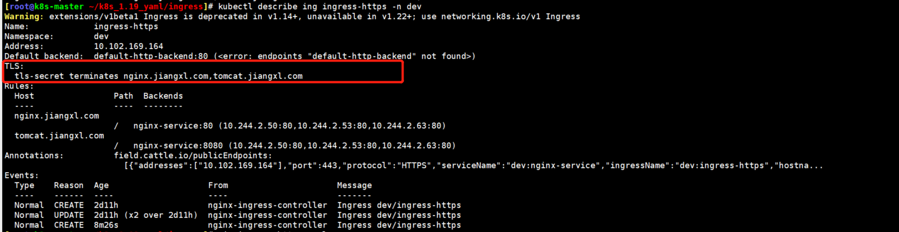
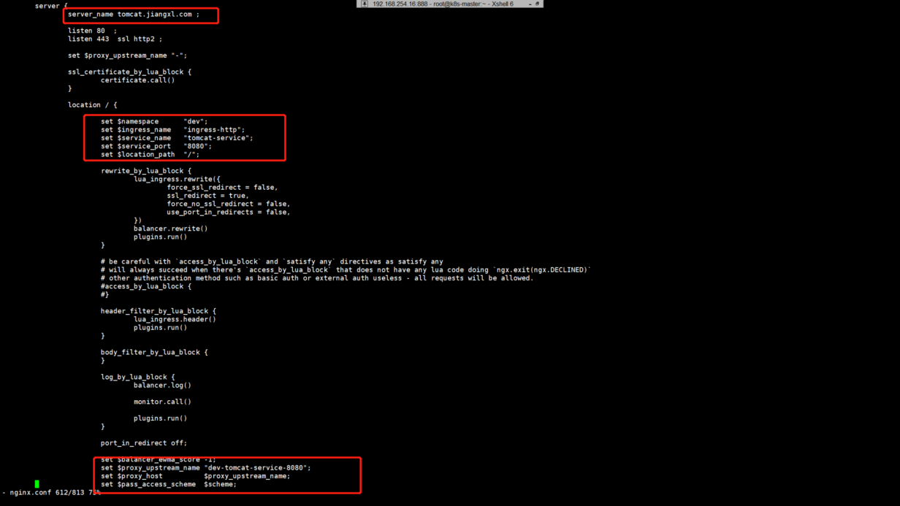
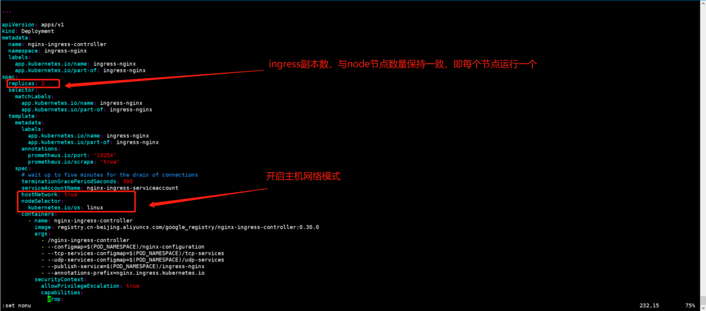
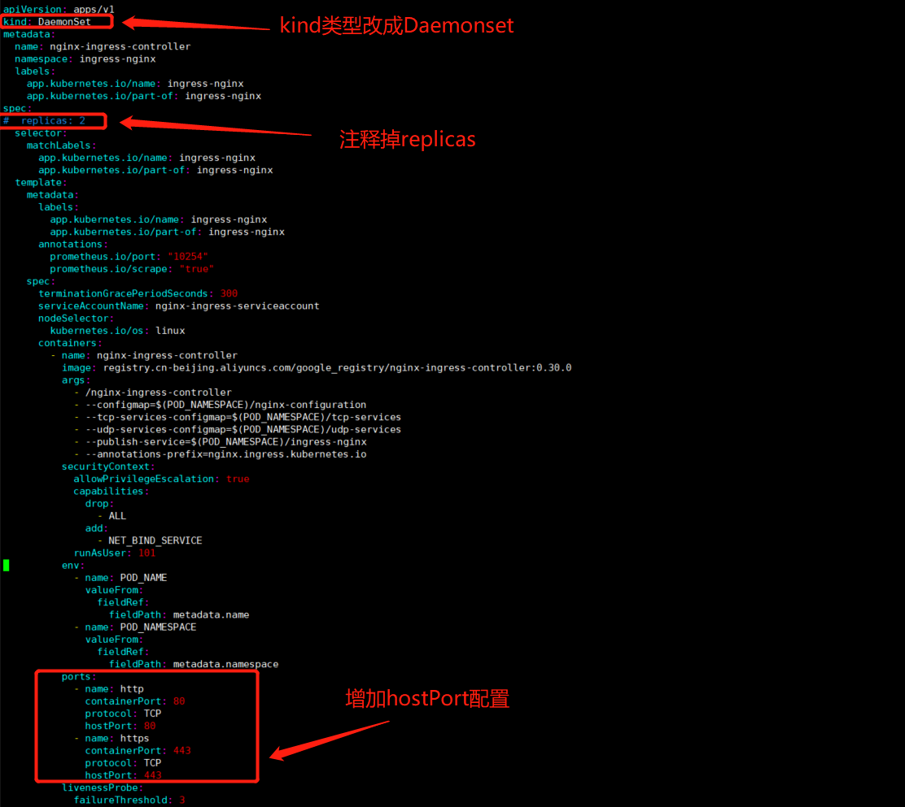

---
layout:
  title:
    visible: true
  description:
    visible: false
  tableOfContents:
    visible: false
  outline:
    visible: true
  pagination:
    visible: false
---

# Ingress

## 一、为什么选择ingress

service 对集群外部暴露主要有两种方式:NodePort 和 LoadBalancer,这两种方式都有一定的缺点:

NodePort 方式的缺点是会占用很多集群机器的端口,当服务变多的时候,service 就需要暴露更多的端口,这个缺点愈发明显。

LB 方式的缺点是每个 service 都需要一个 LB,浪费资源,并且需要外部负载设备的支持

基于这种现状,kubernetes 集群提供了 Ingress 资源对象,Ingress 只需要一个 NodePort 或者一个 LB就可以满足暴露多个 service 的需求。

实际上,Ingress 相当于一个七层负载均衡器,是 k8s 对反向代理的一个抽象,他的工作原理类似于 Nginx，可以理解成在 ingress 中建立映射规则,由 Ingress controller 通过监听这些配置规则并转换成 Nginx 的反向代理配置,然后对外提供服务。

Ingress:kubernetes 中的一个资源对象,作用是定义请求如何转发到 service 的规则,也就是定义如何和某个 service 进行关联

Ingress controller:具体实现反向代理及负载均衡的程序,对 ingress 定义的规则进行解析,根据配置的规则来实现请求转发,实现的方式有很多种,比如 Nginx、Contour、Haproxy

简单的理解为:Ingress 生成关联 service 的规则,由 Ingress controller 解析生成的规则,根据规则来实现反向代理。

`当客户端访问时,首先会将请求转发到 ingress 上,然后通过 Ingress 定义规则,Ingress controller 实现具体的反向代理,当访问 web.zhengjq.com 时就会被转发到 web 的 service 资源上,再由 service 下的 pod提供服务`

Ingress(以 Nginx 为例)原理:

1\. 用户编写 Ingress 规则,声明哪个域名对应 kubernetes 集群中的哪个 service

2.Ingress controller 动态感知 Ingress 服务规则的变化,然后生成一段对应的 nginx 配置3.Ingress controller 会将生成的 nginx 配置写入到一个运行着的 nginx 服务中,并动态更新,只要Ingress 规则有变动,配置就会自动更新

4\. 到此为止,正在工作的就是一个 nginx 了,内部配置了用户定义的请求转发规则,当用户访问,直接就会被转发到 nginx 上,再由 nginx 代理到对应的 service

.png>)

## 二、部署ingress

### 1.获取ingress-nginx yaml文件

```html
[root@k8s-master ~/k8s_1.19_yaml/ingress]# wget https://raw.githubusercontent.com/kubernetes/ingress-nginx/nginx-0.30.0/deploy/static/mandatory.yaml
[root@k8s-master ~/k8s_1.19_yaml/ingress]# wget https://raw.githubusercontent.com/kubernetes/ingress-nginx/nginx-0.30.0/deploy/static/provider/baremetal/service-nodeport.yaml
```

### 2.调整mandatory.yaml中的镜像地址为国内镜像

```
[root@k8s-master ~/k8s_1.19_yaml/ingress]# vim mandatory.yaml
image: quay-mirror.qiniu.com/kubernetes-ingress-controller/nginx-ingress-controller:0.30.0
或者
image: registry.cn-beijing.aliyuncs.com/google_registry/nginx-ingress-controller:0.30.0
```

### 3.创建资源

<pre><code>[root@k8s-master ~/k8s_1.19_yaml/ingress]#<a data-footnote-ref href="#user-content-fn-1"> kubectl apply -f ./</a>
namespace/ingress-nginx created
configmap/nginx-configuration created
configmap/tcp-services created
configmap/udp-services created
serviceaccount/nginx-ingress-serviceaccount created
clusterrole.rbac.authorization.k8s.io/nginx-ingress-clusterrole created
role.rbac.authorization.k8s.io/nginx-ingress-role created
rolebinding.rbac.authorization.k8s.io/nginx-ingress-role-nisa-binding created
clusterrolebinding.rbac.authorization.k8s.io/nginx-ingress-clusterrole-nisa-binding created
deployment.apps/nginx-ingress-controller created
limitrange/ingress-nginx created
service/ingress-nginx created
</code></pre>

### 4.查看ingress的pod

```
[root@k8s-master ~/k8s_1.19_yaml/ingress]# kubectl get deploy,pod -n ingress-nginx
NAME READY UP-TO-DATE AVAILABLE AGE
deployment.apps/nginx-ingress-controller 1/1 1 1 4m1s
NAME READY STATUS RESTARTS AGE
pod/nginx-ingress-controller-766867958b-g2trj 1/1 Running 0 4m
```

#### 5.查看service资源

```
[root@k8s-master ~/k8s_1.19_yaml/ingress]# kubectl get svc -n ingress-nginx
NAME TYPE CLUSTER-IP EXTERNAL-IP PORT(S) AGE
ingress-nginx NodePort 10.102.169.164 <none> 80:30034/TCP,443:31599/TCP 2m32s
```

`#当我们使用ingress对外暴露时，如果采用http访问，则需要使用80映射的30034端口，如果访问https应用，则需要使用443映射的31599端口`

`#不管有多少个service，始终都由一个ingress暴露，因此只能通过域名的形式进行访问`

## 三、准备两个不同的service资源

.png>)

### 1.编写yaml

```
apiVersion: apps/v1
kind: Deployment
metadata:
  name: nginx-deployment
  namespace: dev
spec:
  replicas: 3
  selector:
    matchLabels:
      app: nginx-pod
  template:
    metadata:
      labels:
        app: nginx-pod
    spec:
      containers:
      - name: nginx
        image: nginx:1.17.1
        ports:
        - containerPort: 80
---
apiVersion: v1
kind: Service
metadata:
  name: nginx-service
  namespace: dev
spec:
  selector:
    app: nginx-pod
  type: ClusterIP
  ports:
  - port: 80
    targetPort: 80
---
apiVersion: apps/v1
kind: Deployment
metadata:
  name: tomcat-deployment
  namespace: dev
spec:
  replicas: 3
  selector:
    matchLabels:
      app: tomcat-pod
  template:
    metadata:
      labels:
        app: tomcat-pod
    spec:
      containers:
      - name: tomcat
        image: tomcat:8.5-jre10-slim
        ports:
        - containerPort: 8080
---
apiVersion: v1
kind: Service
metadata:
  name: tomcat-service
  namespace: dev
spec:
  selector:
    app: tomcat-pod
  type: ClusterIP
  ports:
  - port: 8080
    targetPort: 8080
```

### 2.创建资源

```
[root@k8s-master ~/k8s_1.19_yaml/ingress]# kubectl create -f nginx-tomcat.yaml
deployment.apps/nginx-deployment created
service/nginx-service created
deployment.apps/tomcat-deployment created
service/tomcat-service created
```

### 3.查看pod的状态

```
[root@k8s-master ~/k8s_1.19_yaml/ingress]# kubectl get pod -n dev
NAME READY STATUS RESTARTS AGE
nginx-deployment-5ffc5bf56c-d2q4l 1/1 Running 0 21m
nginx-deployment-5ffc5bf56c-dp9l7 1/1 Running 0 21m
nginx-deployment-5ffc5bf56c-j2hpr 1/1 Running 0 21m
tomcat-deployment-7db86c59b7-2tqsp 1/1 Running 0 21m
tomcat-deployment-7db86c59b7-8dfgz 1/1 Running 0 21m
tomcat-deployment-7db86c59b7-jt4xj 1/1 Running 0 21m
```

### 4.查看svc的状态

```
[root@k8s-master ~/k8s_1.19_yaml/ingress]# kubectl get svc -n dev
NAME TYPE CLUSTER-IP EXTERNAL-IP PORT(S) AGE
nginx-service ClusterIP 10.111.226.90 <none> 80/TCP 2m11s
tomcat-service ClusterIP 10.111.216.227 <none> 8080/TCP 2m10s
```

## 四、编写ingress资源清单文件

```
apiVersion: extensions/v1beta1
kind: Ingress
metadata:
  name: ingress-https
  namespace: dev
spec:
  ingressClassName:	<string>			//定义使用哪种类型的ingress controllers
  tls:								//定义域名绑定证书配置，只有通过https访问的方式才需要配置
    - hosts:						//定义程序的域名列表
      - nginx.zhengjq.com
      - tomcat.zhengjq.com
      secretName: tls-secret		//关联对应证书的secret资源
  rules:							//定义ingress规则，用于关联对应的service资源
  - host: nginx.zhengjq.com				//应用域名
    http:								//http方式
      paths:							//定义要访问的路径
      - path: /							//定义访问路径
        backend:						//关联对应的service资源
          serviceName: nginx-service		//对应的service名称
          servicePort: 80					//对应的service端口
```

## 五、Ingress两种暴露方式

### 1、http方式暴露

#### **1.编写yaml**

```
[root@k8s-master ~/k8s_1.19_yaml/ingress]# vim ingress-http.yaml 
apiVersion: extensions/v1beta1
kind: Ingress
metadata:
  name: ingress-http
  namespace: dev
spec:
  rules:									#定义规则
  - host: nginx.zhengjq.com					#定义域名
    http:								#采用http方式
      paths:								#访问的路径
      - path: /	
        backend:							#定义关联的service
          serviceName: nginx-service			#关联的service名称
          servicePort: 80						#关联的service端口
  - host: tomcat.zhengjq.com
    http:
      paths:
      - path: /
        backend:
          serviceName: tomcat-service
          servicePort: 8080
```

#### **2.创建ingress资源**

```
[root@k8s-master ~/k8s_1.19_yaml/ingress]# kubectl create -f ingress-http.yaml
ingress.extensions/ingress-http created
```

#### **3.查看ingress资源**

```
[root@k8s-master ~/k8s_1.19_yaml/ingress]# kubectl get ingress -n dev
NAME CLASS HOSTS ADDRESS PORTS AGE
ingress-http <none> nginx.zhengjq.com,tomcat.zhengjq.com 80 13s
```

#### **4.查看Ingress资源的详细信息**

```
[root@k8s-master ~/k8s_1.19_yaml/ingress]# kubectl describe ingress -n dev
```

`当访问nginx.zhengjq.com域名的/路径时，就会被转发到service资源nginx-service的80端口上，后面是对应pod的信息`

`当访问tomcat.zhengjq.com域名的/路径时，就会被转发到service资源tomcat-service的8080端口上，后面是对应的pod信息`

#### **5.修改Windows本地hosts文件，访问对应的域名验证是否能得到项目内容**

```
位于：C:\Windows\System32\drivers\etc\hosts
192.168.81.210 tomcat.zhengjq.com
192.168.81.210 nginx.zhengjq.com
```

#### **6.访问应用**

访问方式：http://域名:ingress端口号

```
[root@k8s-master ~/k8s_1.19_yaml/ingress]# kubectl get svc -n ingress-nginx
NAME TYPE CLUSTER-IP EXTERNAL-IP PORT(S) AGE
ingress-nginx NodePort 10.102.169.164 <none> 80:30034/TCP,443:31599/TCP 67m
```

由于类型是http，因此采用80端口映射的30034进行访问

### **2、https方式暴露**

#### **1.生成https证书**

```
[root@k8s-master ~/k8s_1.19_yaml/ingress]# openssl req -x509 -sha256 -nodes -days 365 -newkey rsa:2048 -keyout tls.key -out tls.crt -subj "/C=CN/ST=BJ/L=BJ/O=nginx/CN=zhengjq.com"
Generating a 2048 bit RSA private key
............+++
........+++
writing new private key to 'tls.key'
-----
[root@k8s-master ~/k8s_1.19_yaml/ingress]# ll tls.*
-rw-r--r-- 1 root root 1249 3月 24 16:14 tls.crt
-rw-r--r-- 1 root root 1704 3月 24 16:14 tls.key
```

#### **2.创建密钥证书**

```
[root@k8s-master ~/k8s_1.19_yaml/ingress]# kubectl create secret tls tls-secret --key tls.key --cert tls.crt
secret/tls-secret created
```

#### **3.编写yaml**

```
[root@k8s-master ~/k8s_1.19_yaml/ingress]# vim ingress-https.yaml 

apiVersion: extensions/v1beta1
kind: Ingress
metadata:
  name: ingress-https
  namespace: dev
spec:
  tls:								#定义域名绑定证书
    - hosts:						#定义域名
      - nginx.zhengjq.com
      - tomcat.zhengjq.com
      secretName: tls-secret		#绑定的证书名称
  rules:
  - host: nginx.zhengjq.com
    http:
      paths:
      - path: /
        backend:
          serviceName: nginx-service
          servicePort: 80
  - host: tomcat.zhengjq.com
    http:
      paths:
      - path: /
        backend:
          serviceName: tomcat-service
          servicePort: 8080
```

#### **4.创建资源**

```
[root@k8s-master ~/k8s_1.19_yaml/ingress]# kubectl create -f ingress-https.yaml
ingress.extensions/ingress-https created
```

#### **5.查看ingress资源的状态**

```
[root@k8s-master ~/k8s_1.19_yaml/ingress]# kubectl get ing -n dev
NAME CLASS HOSTS ADDRESS PORTS AGE
ingress-http <none> nginx.zhengjq.com,tomcat.zhengjq.com 10.102.169.164 80 24h
ingress-https <none> nginx.zhengjq.com,tomcat.zhengjq.com 10.102.169.164 80, 443 45m
```

`#可以看到https比http多增加一个443端口`

#### **6.查看ingress资源的详细信息**

```
[root@k8s-master ~/k8s_1.19_yaml/ingress]# kubectl describe ing ingress-https -n dev
```

`由于是https，需要域名绑定证书才可以进行访问`



#### **7.本地hosts文件记得修改**

```
位于：C:\Windows\System32\drivers\etc\hosts
192.168.81.210 tomcat.zhengjq.com
192.168.81.210 nginx.zhengjq.com
```

**8.访问应用**

`访问方式：https://域名:ingress端口号`

```
[root@k8s-master ~/k8s_1.19_yaml/ingress]# kubectl get svc -n ingress-nginx
NAME TYPE CLUSTER-IP EXTERNAL-IP PORT(S) AGE
ingress-nginx NodePort 10.102.169.164 <none> 80:30034/TCP,443:31599/TCP 25h
```

`由于做了https加密认证，需要通过443对应的31599访问pod应用`

## 六、进入Ingress容器查看生成的nginx配置

ingress controller会将ingress生成的规则转换成nginx的反向代理配置，进入ingress controller pod即可看到生成的配置

```
[root@k8s-master ~]# kubectl get pod -n ingress-nginx
NAME READY STATUS RESTARTS AGE
nginx-ingress-controller-766867958b-8mfr6 1/1 Running 3 19h
[root@k8s-master ~]# kubectl exec -it nginx-ingress-controller-766867958b-8mfr6 sh -n ingress-nginx
/etc/nginx $ grep -E 'nginx.zhengjq.com|tomcat.zhengjq.com' nginx.conf
## start server nginx.zhengjq.com
server_name nginx.zhengjq.com ;
## end server nginx.zhengjq.com
## start server tomcat.zhengjq.com
server_name tomcat.zhengjq.com ;
## end server tomcat.zhengjq.com
/etc/nginx $ vi nginx.conf
```



## 七、扩展

`ingress映射node节点80/443端口`

2中部署的ingress使用nodeport映射的随机端口，如果是项目的话，每次访问域名还需要加端口，比较麻烦，可以通过共享node主机网络的形式，将ingress映射到本机的443和80端口，当然也可以通过nodeport映射443和80端口，但是也会多一层转发。

ingress不再使用svc将80、443映射成随机端口，而是通过主机网络模式或者主机端口方式将80、443映射到node节点上的80、443。

### 1.通过主机网络模式实现

有了此种方式，master不再暴露80/443端口，只会在node节点暴露80/443端口

#### **1.获取ingress-nginx yaml文件**

```
[root@k8s-master ~/k8s_1.19_yaml/ingress]# wget https://raw.githubusercontent.com/kubernetes/ingress-nginx/nginx-0.30.0/deploy/static/mandatory.yaml
[root@k8s-master1 ~/ingress]# cp mandatory.yaml mandatory-hostnetwork.yaml
```

#### **2.编辑yaml文件，增加主机网络并调整副本数**

```
[root@k8s-master1 ~/ingress]# vim mandatory-hostnetwork.yaml 
apiVersion: apps/v1
kind: Deployment
metadata:
  name: nginx-ingress-controller
  namespace: ingress-nginx
······
spec:
  replicas: 2	#有几个node节点就填写几，如果只有一个副本，那么当着一个ingress坏掉了，集群将不可用
  selector:
    matchLabels:
      app.kubernetes.io/name: ingress-nginx
      app.kubernetes.io/part-of: ingress-nginx
······
      serviceAccountName: nginx-ingress-serviceaccount
      hostNetwork: true	#开启主网络模式，会和pod所在的node节点共用同一个网络，80/443端口也会在node节点运行
      nodeSelector:
        kubernetes.io/os: linux	#node主机调度策略，给所有node节点打上这个标签，默认node节点都有这个标签
```



#### **3.创建资源**

```
[root@k8s-master1 ~/ingress]# kubectl apply -f mandatory-hostnetwork.yaml
namespace/ingress-nginx configured
configmap/nginx-configuration configured
configmap/tcp-services configured
configmap/udp-services configured
serviceaccount/nginx-ingress-serviceaccount configured
clusterrole.rbac.authorization.k8s.io/nginx-ingress-clusterrole configured
role.rbac.authorization.k8s.io/nginx-ingress-role configured
rolebinding.rbac.authorization.k8s.io/nginx-ingress-role-nisa-binding configured
clusterrolebinding.rbac.authorization.k8s.io/nginx-ingress-clusterrole-nisa-binding configured
deployment.apps/nginx-ingress-controller configured
limitrange/ingress-nginx configured
```

#### **4.查看资源状态**

```
[root@k8s-master1 ingress]# kubectl get all -n ingress-nginx
NAME READY STATUS RESTARTS AGE
pod/nginx-ingress-controller-76b49fd66b-4f48f 1/1 Running 0 47s
pod/nginx-ingress-controller-76b49fd66b-4w5fg 1/1 Running 0 2m34s
NAME READY UP-TO-DATE AVAILABLE AGE
deployment.apps/nginx-ingress-controller 2/2 2 2 2m35s
NAME DESIRED CURRENT READY AGE
replicaset.apps/nginx-ingress-controller-76b49fd66b 2 2 2 2m35s
#分别在node1和node2上运行了ingress
```

#### **5.查看node1和node2上有没有开放80/443端口**

```
[root@k8s-node1 ~]# netstat -lnpt | egrep '80|443'
tcp 0 0 0.0.0.0:80 0.0.0.0:* LISTEN 8162/nginx: master
tcp 0 0 0.0.0.0:443 0.0.0.0:* LISTEN 8162/nginx: master
tcp6 0 0 :::80 :::* LISTEN 8162/nginx: master
tcp6 0 0 :::443 :::* LISTEN 8162/nginx: master
[root@k8s-node2 ~]# netstat -lnpt | egrep '80|443'
tcp 0 0 0.0.0.0:80 0.0.0.0:* LISTEN 8783/nginx: master
tcp 0 0 0.0.0.0:443 0.0.0.0:* LISTEN 8783/nginx: master
tcp6 0 0 :::80 :::* LISTEN 8783/nginx: master
tcp6 0 0 :::443 :::* LISTEN 8783/nginx: master
```

### 2.通过主机端口方式实现

`使用DaemonSet资源在每一个node节点运行ingress并通过hostport将端口进行暴露`

\*\*注意：\*\*使用Daemonset+hostPort将ingress端口暴露后，在node节点使用netstat命令是看不到端口的，只要ingress pod正常，业务就可以通过ingress进行访问

#### **1.修改yaml文件，将ingress修改成Daemonset**

```
[root@k8s-master1 ~/ingress]# cp mandatory-hostnetwork.yaml mandatory-hostport.yaml
apiVersion: apps/v1
kind: DaemonSet						#类型改为Daemonset
metadata:
  name: nginx-ingress-controller
  namespace: ingress-nginx
  labels:
    app.kubernetes.io/name: ingress-nginx
    app.kubernetes.io/part-of: ingress-nginx
spec:
#  replicas: 2					#副本数参数主食的
······
          ports:
            - name: http
              containerPort: 80
              protocol: TCP
              hostPort: 80				#hostPort映射到node主机的80端口
            - name: https
              containerPort: 443				
              protocol: TCP
              hostPort: 443			#hostPort映射到node主机的443端口
······
```



**2.创建资源**

```
[root@k8s-master1 ~/ingress]# kubectl create -f mandatory-hostport.yaml
namespace/ingress-nginx created
configmap/nginx-configuration created
configmap/tcp-services created
configmap/udp-services created
serviceaccount/nginx-ingress-serviceaccount created
clusterrole.rbac.authorization.k8s.io/nginx-ingress-clusterrole created
role.rbac.authorization.k8s.io/nginx-ingress-role created
rolebinding.rbac.authorization.k8s.io/nginx-ingress-role-nisa-binding created
clusterrolebinding.rbac.authorization.k8s.io/nginx-ingress-clusterrole-nisa-binding created
daemonset.apps/nginx-ingress-controller created
limitrange/ingress-nginx created
```

#### **3.查看资源状态**

```
[root@k8s-master1 ~/ingress]# kubectl get pod -n ingress-nginx -o wide
NAME READY STATUS RESTARTS AGE IP NODE NOMINATED NODE READINESS GATES
nginx-ingress-controller-4cx7t 1/1 Running 0 4m33s 100.111.156.98 k8s-node1 <none> <none>
nginx-ingress-controller-cpxtl 1/1 Running 0 4m33s 100.64.169.167 k8s-node2 <none> <none>
```

## 八、创建简单的ingress控制器

```
apiVersion: networking.k8s.io/v1                                                                                                          
kind: Ingress                                                                                                                             
metadata:                                                                                                                                 
  name: pong                                                                                                                              
  namespace: ing-internal                                                                                                                 
  annotations:                                                                                                                            
    nginx.ingress.kubernetes.io/rewrite-target: /                                                                                         
spec:                                                                                                                                     
  ingressClassName: nginx                                                                                                                 
  rules:                                                                                                                                  
    http:                                                                                                                                 
      paths:                                                                                                                              
      - path: /hello                                                                                                                      
        pathType: Prefix                                                                                                                  
        backend:                                                                                                                          
          service:                                                                                                                        
            name: test                                                                                                                    
            port:                                                                                                                         
              number: 5678     
```

### 九、yaml文件详解

Ingress annotations在Kubernetes中扮演着重要角色，特别是当与Ingress控制器（如Nginx, Traefik等）结合使用时。Annotations允许用户在Ingress资源上附加额外的配置信息，这些信息可以被Ingress控制器用来修改负载均衡器、代理服务器或其他网络设备的行为。

以下是一些常见的Ingress annotations及其作用：

`1、kubernetes.io/ingress.class:`

`指定应该使用哪个Ingress控制器来处理此Ingress资源。例如，如果你集群中有多个Ingress控制器（如Nginx和Traefik），你可以使用这个annotation来指定使用哪一个。`

`2、nginx.ingress.kubernetes.io/rewrite-target:`

`对于Nginx Ingress控制器，此annotation用于重写URL的路径部分。例如，如果你希望将所有到达/app路径的请求重定向到/，你可以使用这个annotation。`

`3、nginx.ingress.kubernetes.io/ssl-redirect:`

`指示Nginx Ingress控制器将所有HTTP请求重定向到HTTPS。通常用于强制HTTPS。`

`4、nginx.ingress.kubernetes.io/affinity:`

`设置客户端IP的会话保持策略，以确保来自同一客户端的请求被路由到同一个后端Pod。`

`5、nginx.ingress.kubernetes.io/configuration-snippet:`

`允许你在Nginx的配置文件中插入自定义的片段。这可以用于实现Nginx的某些高级功能，这些功能不能通过标准的Ingress资源字段或annotations来实现。`

`6、nginx.ingress.kubernetes.io/force-ssl-redirect:`

`类似于ssl-redirect，但更为严格。它会强制将所有HTTP请求重定向到HTTPS，并拒绝任何非HTTPS的请求。`

`7、traefik.ingress.kubernetes.io/router.entrypoints:`

`对于Traefik Ingress控制器，此annotation用于指定入口点（即监听的网络地址和端口）。`

`8、traefik.ingress.kubernetes.io/router.middlewares:`

`允许你在Traefik Ingress上附加中间件，以处理诸如重定向、重写、认证等任务。`

`9、cert-manager.io/cluster-issuer:`

`当使用cert-manager来自动管理TLS证书时，此annotation指定了应该使用哪个ClusterIssuer来签发证书。`

`10、haproxy.org/ingress.class:`

`对于HAProxy Ingress控制器，类似于kubernetes.io/ingress.class，用于指定Ingress类。`

`11、haproxy.org/path-rewrite:`

`在HAProxy Ingress控制器中，用于重写请求的路径。`

这些annotations的具体可用性和行为可能因Ingress控制器的版本和配置而异。在使用之前，建议查阅相应Ingress控制器的官方文档以获取最准确的信息。此外，随着Kubernetes和Ingress控制器生态系统的不断发展，新的annotations可能会不断被引入。

[^1]: 
